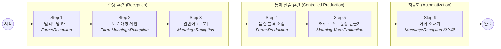

# [제안서] 다문화 학생 맞춤형 어휘 학습 프로그램: <어휘의 징검다리>
**어휘학습을 통해 개념기반학습 기틀 마련하기**

---

## 1. 기획 배경 및 대상 분석

**대상:** 학급 인원 17명 (중도입국 및 다문화 가정 학생 15명 포함, 88% 비중)

**핵심 문제(Pain Point):**

- **음운 인식 부족:** 한글 자모와 소리의 연결이 약해 텍스트만으로는 암기가 어려움.
- **좌절감:** 타이핑(철자 입력) 단계에서 높은 진입 장벽과 이탈 발생.
- **찍기 습관:** 4지 선다형의 소거법으로 인해 '아는 착각(Fluency Illusion)' 발생.

**설계 목표:** 직관적 UI(터치)와 청각 자극을 통해 진입 장벽을 낮추고, Nation(2013)의 단어 지식 프레임워크에 기반한 6단계 스캐폴딩(Scaffolding)으로 **수용(Reception)에서 산출(Production)까지** 완전 학습을 유도한다.

**타겟 지표:**

| 지표 | 현 시점(가정) | 목표 |
|------|:---:|:---:|
| 어휘 학습 자유 산출율 | 10% | 70% |
| 다문화-한국 학생 성취도 격차 | 25%p | 10%p |

**어휘 범위:** 5-6학년 학습도구어를 1차 대상으로 하며, 추후 학습 내용어로 확장 예정.

---

## 2. 이론적 기반: Nation(2013) Word Knowledge Framework

본 프로그램의 단계 설계는 Nation(2013)이 제시한 **단어 지식의 두 축**에 근거한다.

**축 1 — 수용(Reception) → 산출(Production)**
- 수용: 단어를 듣거나 읽고 의미를 인식하는 능력
- 산출: 적절한 맥락에서 단어를 선택하고 사용하는 능력

**축 2 — 형태(Form) · 의미(Meaning) · 사용(Use)**
- 형태: 소리, 철자, 단어 구조
- 의미: 뜻, 연상, 관련 개념
- 사용: 문법적 기능, 연어, 사용 맥락

### 6단계 × Nation 매핑

| Step | 게임 이름 | 축1: 수용/산출 | 축2: 형태/의미/사용 |
|:---:|------|:---:|:---:|
| 1 | 멀티모달 카드 | Reception | Form |
| 2 | N+2 매칭 게임 | Reception | Form + Meaning |
| 3 | 관련어 고르기 | Reception | Meaning |
| 4 | 음절 블록 조립 | Controlled Production | Form |
| 5-1 | 블라인드 어휘 퀴즈 | Controlled Production | Meaning |
| 5-2 | 문장 어절 조립 | Controlled Production | Use |
| 6 | 어휘 소나기 | Reception (자동화) | Meaning |

> **설계 원리:** Step 1→3은 수용 훈련으로 단어의 형태와 의미를 각인하고, Step 4→5는 통제 산출 훈련으로 형태→의미→사용 순서로 산출 능력을 확장한다. Step 6은 수용 단계의 자동화(유창성)를 게임으로 강화한다.

---

## 3. 프로그램 흐름도 (Process Flowchart)

---

## 4. 단계별 상세 설계 및 의도

### Step 1. 멀티모달(Multi-modal) 카드 — Form × Reception

**구성:** 아이콘(그림) + 단어(텍스트) + TTS 원어민 발음 + 다국어 번역(중국어/러시아어 선택)

**상호작용:**
- 카드 앞면: 아이콘과 단어가 크게 표시되며 TTS가 자동 재생된다.
- 터치하면 뒤집기: 뜻, 예문(핵심어 강조), 번역이 나타나고 전체 문장을 읽어준다.
- 하단 [몰라요/알아요] 버튼으로 자기 평가 → 모르는 단어는 덱에 재투입되어 자동 반복.

**PM의 전략:** 카드가 뒤집힐 때 소리가 자동 재생된다. 학생이 '듣기'를 생략할 수 없도록 강제 설계하여, 시각-청각 통합 노출을 보장한다. 다국어 모드를 제공해 중도입국 학생의 모국어 보조 역할을 한다.

**교육적 의도:** 이중 부호화(Dual Coding) 이론 적용. 다문화 학생의 약점인 청각-시각 연결을 강화하여 단어의 **형태(Form)**를 수용 수준에서 각인한다.

---

### Step 2. N+2 매칭 게임 — Form·Meaning × Reception

**구성:** 4개의 그림(아이콘) 슬롯 ↔ 6개의 단어 카드(정답 4 + 방해 2). 총 5라운드, 복습 단어 재등장.

**상호작용:**
- 단어 카드를 터치(또는 드래그)하여 올바른 그림 슬롯에 배치한다.
- 그림 슬롯을 터치하면 힌트 문장이 TTS로 재생된다.
- 정답 4개를 모두 매칭하면, 남은 방해 카드 2개를 별도 영역에 버린다.
- 오답 시 슬롯이 흔들리며 피드백 제공.

**PM의 전략:** 남는 2개의 방해 카드(Distractors) 때문에 끝까지 소거법을 쓸 수 없다. 마지막 하나까지 정확히 읽고 판단해야 하는 **Anti-Guessing** 구조다. 방해 카드 처리 메커닉은 오답을 명시적으로 '걸러내는' 행동을 유도해 변별력을 강화하며, 게임적 재미를 부여한다.

**교육적 의도:** 단순 재인(Recognition) 테스트의 허점을 보완하고, 단어의 형태와 의미를 능동적으로 연결(Form + Meaning × Reception)한다.

---

### Step 3. 관련어 고르기 — Meaning × Reception

**구성:** 핵심 단어 1개 제시. 8개의 보기(관련어 4 + 비관련어 4) 중에서 관련어 4개를 선택.

**상호작용:**
- 보기를 터치하여 선택/해제한다. 최대 4개까지 선택 가능.
- [힌트] 버튼: 정답 1개를 자동 선택해 주고, 해당 문제 최대 점수가 1점으로 제한된다.
- [채점] 버튼으로 정답 확인. 오답 시 재시도 1회 제공.

**PM의 전략:** 4지 선다가 아닌 **8개 중 4개 선택** 구조로, 단순 소거법을 원천 차단한다. 학생이 관련어와 비관련어를 적극적으로 구분해야 하므로, 의미 범주(Semantic Category)를 능동적으로 형성하게 된다.

**교육적 의도:** Nation의 **Meaning × Reception** 단계. 단어의 개별 뜻 암기를 넘어, 의미적 연상 네트워크(Associative Network)를 구축한다. 무엇이 관련되고 무엇이 관련되지 않는지를 판단하여 개념 경계를 확립하는 **변별 학습(Discrimination Learning)**에 해당한다.

---

### Step 4. 음절 블록 조립 — Form × Controlled Production

**구성:** 문장의 빈칸에 들어갈 단어를, 화면 하단에 흩어진 음절 블록을 조합하여 완성한다.

**상호작용:**
- 문장과 아이콘이 제시되고, TTS가 빈칸 문장을 읽어준다.
- 하단의 음절 블록(정답 음절 + 방해 음절)을 순서대로 터치하여 빈칸을 채운다.
- Easy 모드: 빈칸에 흐린 글자 힌트가 표시된다. Hard 모드: 힌트 없이 방해 음절이 추가된다.
- 모든 칸이 채워지면 자동 채점. 오답 시 슬롯이 흔들리고 재시도 유도.

**PM의 전략:** 타이핑의 오타 스트레스를 완전히 제거하고, 터치 인터페이스에 최적화한다. 음절 단위 조립은 초성 힌트보다 직관적이며, 단어의 구조를 능동적으로 재구성(Reconstruction)하는 훈련이 된다.

**교육적 의도:** Nation의 **Form × Controlled Production** 단계. 단어의 형태(철자/구조)를 수동적으로 인식하는 것을 넘어, 스스로 재구성하는 최초의 산출 활동이다.

---

### Step 5. 어휘 퀴즈 + 문장 만들기 — Meaning·Use × Controlled Production

이 단계는 내부에 2단계 스캐폴딩 구조를 가진다.

#### Stage 1: 블라인드 어휘 퀴즈 — Meaning × Controlled Production

**구성:** 단어가 "?????"로 숨겨져 있고, 뜻(정의)만 강조 표시된다. 문장의 빈칸에 들어갈 올바른 어구를 2개 선지 중에서 고른다.

**상호작용:**
- 뜻을 읽고, 문장 맥락을 파악하여 정답 어구를 선택한다.
- 선지에는 유사음 오답이 포함된다. (예: "해결 **방식**을" vs "해결 **방석**을")
- 정답 시 자동으로 다음 문제 이동. 오답 시 "뜻을 다시 읽어보세요" 피드백.

**PM의 전략:** 단어 자체를 보여주지 않고 뜻만으로 판단하게 하여, '글자를 대충 보고 고르는' 습관을 차단한다. 유사음 방해 선지(방식/방석, 영향/영양, 단서/단추)는 형태적 유사성에 속지 않고 **의미에 집중**하도록 유도한다.

**교육적 의도:** 뜻을 통해 올바른 형태를 산출하는 **Meaning × Production** 활동. 수용에서 받아들인 의미 지식을 역방향으로 활용하여, 의미로부터 형태를 도출하는 능력을 훈련한다.

#### Stage 2: 문장 어절 조립 — Use × Controlled Production

**구성:** 단어가 공개된다. 흩어진 어절 카드(정답 어절 + 방해 어절)를 올바른 어순으로 배열하여 문장을 완성한다.

**상호작용:**
- 어절 카드를 터치하여 슬롯에 순서대로 배치한다.
- 각 슬롯에는 문법 힌트 라벨이 표시된다. (예: "누가?", "언제?", "무엇을?", "어찌했나?")
- [함정 제거] 버튼으로 방해 카드 1개를 제거할 수 있다 (힌트 사용 시 최대 1점).
- [정답 확인] 시 맞은 카드는 초록으로 고정되고, 틀린 카드만 되돌려진다.

**PM의 전략:** 방해 어절이 포함되어 있어 문장의 문법적 구조를 정확히 파악해야 한다. 단순 어순 나열이 아니라 조사와 서술어의 호응을 판단하는 훈련이다.

**교육적 의도:** Nation의 **Use × Production** 단계. 단어를 문장 맥락 속에서 올바른 위치에 배치하는 통제 산출 활동으로, 문법적 기능과 연어(Collocation) 관계를 체화한다.

---

### Step 6. 어휘 소나기 — Meaning × Reception (자동화)

**구성:** 캔버스 기반 낙하 게임. 화면 상단에 핵심 단어가 크게 표시되고, 관련/비관련 단어가 버블 형태로 위에서 떨어진다.

**상호작용:**
- 관련 단어를 터치하면 점수 획득(+10). 비관련 단어를 터치하면 감점(-10).
- 관련 단어를 4개 모으면 다음 핵심 단어로 전환된다.
- 연속 정답 시 콤보 보너스. 콤보가 쌓일수록 낙하 속도가 빨라진다.
- 시간 제한 80초. 모든 단어를 클리어하거나 시간이 종료되면 결과 화면.

**PM의 전략:** Step 3(관련어 고르기)과 동일한 교육 목표를 **게이미피케이션**으로 재포장한 단계다. 시간 압박과 콤보 시스템으로 몰입감을 높여, 학습 세션의 마무리를 '재미있는 경험'으로 마감한다. 학생들이 자발적으로 재도전하도록 유도한다.

**교육적 의도:** 시간 압박 속에서의 빠른 어휘 인출(Retrieval) 훈련. 수용 단계에서 형성된 의미 연결을 **자동화(Automatization)**하여, 의식적 노력 없이도 관련어를 판별할 수 있는 유창성(Fluency)을 확보한다.

---

## 5. 공통 채점 규칙 (Step 2~5 통일)

| 조건 | 점수 |
|------|:---:|
| 정답 (힌트 없이) | 2점 |
| 정답 (힌트 사용 후) | 1점 |
| 오답 / 재시도 실패 | 0점 |

- 힌트: 문제당 **1회** 제공
- 재시도: 문제당 **1회** 제공
- Step 1은 자기평가(알아요/몰라요) 방식으로 별도 채점 없음
- Step 6은 점수제(터치 기반)로 별도 운영

---

## 6. 기대 효과 (Expected Outcomes)

**진입 장벽 최소화:** 타이핑을 전면 제거하고 소리·터치·드래그 위주로 설계하여, 한국어 능력이 부족한 학생도 6단계를 '완주'할 수 있다.

**메타인지 향상:** 찍기가 불가능한 구조(N+2 매칭, 8개 중 4개 선택, 유사음 변별)를 통해 학생 스스로 '내가 아는 것과 모르는 것'을 정확히 파악하게 된다.

**수용→산출 완전 학습 경로:** Nation(2013)의 Form·Meaning·Use 전 영역을 커버하는 6단계 설계로, 단순 암기에서 끝나는 것이 아니라 단어를 문장 속에서 산출하는 능력까지 도달한다. 이는 **자유 산출율 10% → 70%** 달성의 구조적 근거가 된다.

**성취 격차 축소:** 다국어 지원(Step 1), 직관적 터치 UI, 자동 반복 시스템으로 다문화 학생의 진입 장벽을 낮추어 **다문화-한국 학생 성취 격차 25%p → 10%p** 축소를 기대한다.

**개념기반학습 기틀 마련:** 학습도구어의 의미 네트워크 구축(Step 3, 6)과 문맥 속 사용 훈련(Step 5)을 통해, 이후 교과 내용어 학습과 개념 기반 수업 참여를 위한 어휘적 토대를 형성한다.
