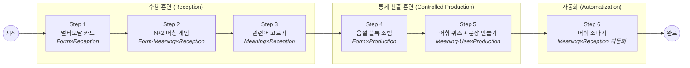

# [제안서 v3] 다문화 학생 맞춤형 어휘 학습 프로그램: <어휘의 징검다리>
**학습도구어 기반 6단계 어휘 학습 플랫폼 — 통합 기획·개발 명세서**

> **문서 목적:** 이 문서는 교육적 근거(이론), 제품 설계(기획), 구현 기준(개발)을 단일 문서로 통합한다.
> 기획자·개발자·교사가 동일한 맥락에서 참조할 수 있도록 작성되었다.

---

## 문서 메타
- **버전:** 3.0 (통합본)
- **작성일:** 2026-03-07
- **통합 대상:** `multicultural_literacy_proposal.md` (v2.0) + `proposal_v2.md`
- **관련 산출물:** `vocab_list/vocab_review_checklist_filled.csv`, `collaboration/requirements_2026-03-07.md`

---

## 1. 기획 배경 및 대상 분석

**대상:** 학급 인원 17명 (중도입국 및 다문화 가정 학생 15명 포함, 88% 비중)

**핵심 문제(Pain Point):**
- **음운 인식 부족:** 한글 자모와 소리의 연결이 약해 텍스트만으로는 암기가 어려움.
- **좌절감:** 타이핑(철자 입력) 단계에서 높은 진입 장벽과 이탈 발생.
- **찍기 습관:** 4지 선다형의 소거법으로 인해 '아는 착각(Fluency Illusion)' 발생.
- **학습도구어 노출 부족:** 교과 지시문 이해, 개념 설명/비교/분류 같은 학습 언어 산출에서 불리함.

**설계 목표:** 직관적 UI(터치)와 청각 자극을 통해 진입 장벽을 낮추고, Nation(2013)의 단어 지식 프레임워크에 기반한 6단계 스캐폴딩으로 **수용(Reception)에서 산출(Production)까지** 완전 학습을 유도한다.

**핵심 문제:** 단순 단어 암기가 아니라, 교과 맥락에서 단어를 "산출"하지 못하는 데 있다.

**타겟 지표:**

| 지표 | 현 시점(가정) | 목표 |
|------|:---:|:---:|
| 어휘 학습 자유 산출율 | 10% | 70% |
| 다문화-한국 학생 성취도 격차 | 25%p | 10%p |

**어휘 범위:** 5-6학년 학습도구어를 1차 대상으로 하며, 추후 학습 내용어로 확장 예정.

---

## 2. 제품 목표

### 2.1 교육 목표
- 학습도구어를 수용 수준에서 산출 수준으로 끌어올린다.
- 학생별 오류율을 추적해 Tier 2/Tier 3 개입 대상을 자동 식별한다.
- 다문화 학생과 전체 학생 간 단계별 격차를 줄인다.

### 2.2 운영 목표
- 교사는 수업 중 실시간으로 위험 학생을 확인할 수 있어야 한다.
- 학생 리포트와 월간 그룹 리포트를 PDF로 바로 출력할 수 있어야 한다.
- 개입 이력(무엇을, 언제, 얼마나, 효과가 있었는지)을 데이터로 남긴다.

---

## 3. 이론적 기반: Nation(2013) Word Knowledge Framework

본 프로그램의 단계 설계는 Nation(2013)이 제시한 **단어 지식의 두 축**에 근거한다.

**축 1 — 수용(Reception) → 산출(Production)**
- 수용: 단어를 듣거나 읽고 의미를 인식하는 능력
- 산출: 적절한 맥락에서 단어를 선택하고 사용하는 능력

**축 2 — 형태(Form) · 의미(Meaning) · 사용(Use)**
- 형태: 소리, 철자, 단어 구조
- 의미: 뜻, 연상, 관련 개념
- 사용: 문법적 기능, 연어, 사용 맥락

> **주의:** Level 4/5는 자유 산출(Free Production)이 아니라 통제 산출(Controlled Production)으로 정의한다.

### 6단계 × Nation 매핑

| Step | 게임 이름 | 축1: 수용/산출 | 축2: 형태/의미/사용 |
|:---:|------|:---:|:---:|
| 1 | 멀티모달 카드 | Reception | Form |
| 2 | N+2 매칭 게임 | Reception | Form + Meaning |
| 3 | 관련어 고르기 | Reception | Meaning |
| 4 | 음절 블록 조립 | Controlled Production | Form |
| 5-1 | 블라인드 어휘 퀴즈 | Controlled Production | Meaning |
| 5-2 | 문장 어절 조립 | Controlled Production | Use |
| 6 | 어휘 소나기 | Reception (자동화) | Meaning |

> Step 1→3은 수용 훈련으로 단어의 형태와 의미를 각인하고, Step 4→5는 통제 산출 훈련으로 형태→의미→사용 순서로 산출 능력을 확장한다. Step 6은 수용 단계의 자동화(유창성)를 게임으로 강화한다.

### RTI 매핑
- Tier 1: 전체 학생 공통 학습
- Tier 2: 소그룹 보충
- Tier 3: 1:1 집중 지도

### 오류율 판정 기준
- 0 ~ 20%: 습득 완료
- 20 ~ 35%: 발달 중
- 35 ~ 50%: Tier 2
- 50% 초과: Tier 3

---

## 4. 프로그램 흐름도



---

## 5. 1차 출시 범위 (Release 1)

### 5.1 출시일
- 2026-03-01

### 5.2 포함 범위
- 학습 1~6단계 전부
- 교사/학생 역할
- 교사 수동 학생 등록
- 실시간 교사 대시보드
- 레벨 1~3 리포트
- PDF 출력
- 오류율 자동 분류
- 개입 로그 저장/조회

### 5.3 제외 범위 (2차 이관)
- 사전/사후 총괄평가 모듈
- 자유 산출 자동 채점
- 적응형 난이도

---

## 6. 학습 경험 설계

### 6.1 세션 규칙
- 1회 학습 목표 시간: 10~20분
- 1차에서는 시간 제한 없음
- 힌트 1회
- 재시도 1회
- 단계 자동 이동
- 문항 순서 랜덤

### 6.2 공통 채점 규칙 (Step 2~5)

| 조건 | 점수 |
|------|:---:|
| 정답 (힌트 없이) | 2점 |
| 정답 (힌트 사용 후) | 1점 |
| 오답 / 재시도 실패 | 0점 |

- Step 1: 자기평가(알아요/몰라요) 방식으로 별도 채점 없음
- Step 6: 점수제(터치 기반)로 별도 운영

---

## 7. 6단계 상세 설계

### Step 1. 멀티모달 카드 — Form × Reception

**구성:** 아이콘(그림) + 단어(텍스트) + TTS 자동 재생 + 다국어 번역(중국어/러시아어 선택)

**상호작용:**
- 카드 앞면: 아이콘과 단어가 크게 표시되며 TTS가 자동 재생.
- 터치하면 뒤집기: 뜻, 예문(핵심어 강조), 번역이 나타나고 전체 문장을 읽어줌.
- 하단 [몰라요/알아요] 버튼으로 자기 평가 → 모르는 단어는 덱에 재투입되어 자동 반복.

**교육적 의도:** 이중 부호화(Dual Coding) 이론 적용. 시각-청각 연결 강화, 단어의 **형태(Form)**를 수용 수준에서 각인.

**현재 구현:** `src/games/Step01.jsx` (lucide-react 아이콘 사용, 실제 이미지 교체 검토 중)

---

### Step 2. N+2 매칭 게임 — Form·Meaning × Reception

**구성:** 4개의 그림(아이콘) 슬롯 ↔ 6개의 단어 카드(정답 4 + 방해 2). 총 5라운드.

**상호작용:**
- 단어 카드를 터치(또는 드래그)하여 올바른 그림 슬롯에 배치.
- 그림 슬롯을 터치하면 힌트 문장이 TTS로 재생.
- 정답 4개 매칭 후 방해 카드 2개를 별도 영역에 버림(몬스터 클리어).
- 오답 시 슬롯이 흔들리며 피드백 제공.

**Anti-Guessing 전략:** 방해 카드 2장으로 소거법 불가. 마지막 단어까지 능동적으로 판단해야 함.

**교육적 의도:** 형태와 의미를 능동적으로 연결 **(Form + Meaning × Reception)**.

**현재 구현:** `src/games/Step02.jsx`

---

### Step 3. 관련어 고르기 — Meaning × Reception

**구성:** 핵심 단어 1개 제시. 8개 보기(관련어 4 + 비관련어 4) 중 관련어 4개 선택.

**상호작용:**
- 보기 터치로 선택/해제. 최대 4개 선택 가능.
- [힌트] 버튼: 정답 1개 자동 선택, 해당 문제 최대 1점으로 제한.
- [채점] 버튼으로 정답 확인. 오답 시 재시도 1회.
- "단어 듣기" 버튼: 핵심 단어 먼저 읽고, 8개 선택지를 화면 배치 순서(왼→오 위쪽 줄, 왼→오 아래 줄)대로 읽음. *(개선 예정)*

**Anti-Guessing 전략:** 8개 중 4개 선택 구조로 단순 소거법 원천 차단.

**교육적 의도:** 의미적 연상 네트워크(Associative Network) 구축, 변별 학습(Discrimination Learning). **Meaning × Reception.**

**현재 구현:** `src/games/Step03.jsx` (9개 핵심어, 최대 18점)

---

### Step 4. 음절 블록 조립 — Form × Controlled Production

**구성:** 문장의 빈칸에 들어갈 단어를 음절 블록 조합으로 완성.

**상호작용:**
- 문장과 아이콘 제시, TTS가 빈칸 문장 읽기.
- 음절 블록(정답 음절 + 방해 음절)을 순서대로 터치하여 빈칸 채우기.
- Easy 모드: 빈칸에 흐린 글자 힌트 표시. Hard 모드: 힌트 없이 방해 음절 추가.
- 모든 칸 채워지면 자동 채점. 오답 시 슬롯 흔들림 후 재시도 유도.

**교육적 의도:** 타이핑 스트레스 제거, 터치 최적화. 단어 구조를 능동적으로 재구성. **Form × Controlled Production.**

**현재 구현:** `src/games/Step04.jsx` (8개 단어, Easy/Hard 난이도)

---

### Step 5. 어휘 퀴즈 + 문장 만들기 — Meaning·Use × Controlled Production

이 단계는 내부에 2단계 스캐폴딩 구조를 가진다.

#### Stage 1: 블라인드 어휘 퀴즈 — Meaning × Controlled Production

**구성:** 단어가 "?????"로 숨겨져 있고, 뜻(정의)만 강조 표시. 문장의 빈칸에 들어갈 올바른 어구를 2지선다로 선택.

**중요:** 빈칸은 반드시 뜻이 제시된 **핵심 단어(또는 그 활용형)**여야 함. *(개선 예정)*

> **예시 (단어: 재다)**
> - 현재 문제: 나는 수학 시간에 `(          )재어 보았다.` ← 핵심 단어가 아닌 부분이 빈칸 (문제)
> - 수정 문제: 나는 수학 시간에 자로 길이를 `(          ).` ← 핵심 단어 활용형이 빈칸 (목표)
> - 선택지: **재어 보았다** / 세어 보았다

**교육적 의도:** 뜻만으로 올바른 형태를 산출하는 **Meaning × Production** 활동.

#### Stage 2: 문장 어절 조립 — Use × Controlled Production

**구성:** 단어 공개 후, 흩어진 어절 카드(정답 + 방해)를 올바른 어순으로 배열하여 문장 완성.

**상호작용:**
- 어절 카드 터치로 슬롯에 순서대로 배치.
- 각 슬롯에 문법 힌트 라벨 표시 (예: "누가?", "언제?", "무엇을?", "어찌했나?").
- [함정 제거] 버튼으로 방해 카드 1개 제거 가능 (힌트 사용 시 최대 1점).
- 정답 확인 시 맞은 카드는 초록으로 고정, 틀린 카드만 되돌려짐.

**교육적 의도:** 문장 맥락 속 올바른 위치 배치, 조사·서술어 호응 훈련. **Use × Production.**

**현재 구현:** `src/games/Step05.jsx` (10개 어휘, 최대 30점)

---

### Step 6. 어휘 소나기 — Meaning × Reception (자동화)

**구성:** 캔버스 기반 낙하 게임. 화면 상단에 핵심 단어 표시, 관련/비관련 단어가 버블 형태로 낙하.

**상호작용:**
- 관련 단어 터치: 점수 획득(+10). 비관련 단어 터치: 감점(-10).
- 관련 단어 4개 수집 시 다음 핵심 단어로 전환.
- 연속 정답 시 콤보 보너스. 콤보 증가 시 낙하 속도 빨라짐.
- 시간 제한 80초. 클리어 또는 시간 종료 시 결과 화면.

**교육적 의도:** 시간 압박 속 빠른 어휘 인출(Retrieval) 훈련. 의미 연결의 **자동화(Automatization)**로 유창성(Fluency) 확보.

**현재 구현:** `src/games/Step06.jsx` (Canvas 기반, 9개 주제, 콤보 시스템)

---

## 8. 콘텐츠 정책

### 8.1 데이터 원천
- 원본: `학습도구 56학년.xlsx`
- 헤더 제외 140개 → 중복 제거 127개 → 운영 선정본: **90개**
- 검수 파일: `vocab_list/vocab_review_checklist_filled.csv`

### 8.2 단어 필수 필드
- 뜻
- 예문 3개
- 그림(이미지 또는 프롬프트)
- 관련어 10개
- L4 음절선택 문항
- L5 어절조립 문항

### 8.3 콘텐츠 생성/검수
- 뜻/예문: 한국어기초사전 1차 반영 후 교실 톤으로 교사 검수
- 그림: AI 생성 또는 실제 이미지 파일
- 최종 승인자: 교사(사용자)

---

## 9. 데이터 모델

### 9.1 students
```json
{
  "student_id": "S001",
  "name": "홍길동",
  "grade_class": "3-2",
  "is_multicultural": true,
  "created_by": "T001",
  "created_at": "2026-02-13T09:00:00"
}
```

### 9.2 words
```json
{
  "word_id": "W001",
  "word": "설명",
  "meaning": "어떤 내용을 알기 쉽게 풀어 말함",
  "example_1": "...",
  "example_2": "...",
  "example_3": "...",
  "image_prompt": "...",
  "related_words": ["...", "..."],
  "l4_draft": "정답:설명 | 보기:...",
  "l5_draft": "정답문장:... | 카드:..."
}
```

### 9.3 learning_records
```json
{
  "record_id": "R001",
  "student_id": "S001",
  "word_id": "W001",
  "stage_results": [
    {"stage": 1, "score": 2},
    {"stage": 2, "score": 2},
    {"stage": 3, "score": 1},
    {"stage": 4, "score": 2},
    {"stage": 5, "score": 0}
  ],
  "error_rate": 30.0,
  "tier": "development",
  "completed_at": "2026-02-13T10:30:00"
}
```

### 9.4 intervention_logs
```json
{
  "intervention_id": "INT_001",
  "student_id": "S001",
  "teacher_id": "T001",
  "type": "tier2_small_group",
  "focus_words": ["번갈다", "입자"],
  "duration_min": 10,
  "before_error_rate": 62.0,
  "after_error_rate": 44.0,
  "memo": "조사/어절 조립 집중",
  "created_at": "2026-02-13T14:20:00"
}
```

---

## 10. 기술 스택

- **Frontend:** React 19 + Vite 7 + Tailwind CSS 4
- **Backend:** Firebase (Auth, Firestore, Storage, Functions)
- **TTS:** Web Speech API
- **배포:** Firebase Hosting 또는 Vercel

---

## 11. 개발 우선순위

### 11.1 반드시 먼저
- 인증/권한 (교사, 학생)
- 학생 등록/학급 관리
- 학습 1~6단계 흐름
- 채점/오류율 계산
- 리포트 레벨 1~3

### 11.2 직후
- PDF 출력 완성도 개선
- 개입 로그 기반 추천 문구
- 운영 모니터링/에러 추적

### 11.3 2차
- 적응형 난이도
- 사전/사후 총괄평가 모듈
- 자유 산출 평가 확장

---

## 12. 수용 기준 (Release 1)

- [ ] 학생 25명 동시 학습 시 주요 기능 정상 동작
- [ ] 1~6단계 완료 후 오류율 자동 계산/분류 정상
- [ ] Tier 2/3 대상 대시보드 자동 노출
- [ ] 학생 개인 리포트 PDF 출력 정상
- [ ] 월간 그룹 리포트 PDF 출력 정상
- [ ] 개입 로그 저장 및 조회 정상
- [ ] 90개 단어 세트 로딩/학습 정상

---

## 13. 기대 효과

**진입 장벽 최소화:** 타이핑을 전면 제거하고 소리·터치·드래그 위주로 설계하여, 한국어 능력이 부족한 학생도 6단계를 완주할 수 있다.

**메타인지 향상:** 찍기가 불가능한 구조(N+2 매칭, 8개 중 4개 선택, 유사음 변별)를 통해 학생 스스로 '내가 아는 것과 모르는 것'을 정확히 파악하게 된다.

**수용→산출 완전 학습 경로:** Nation(2013)의 Form·Meaning·Use 전 영역을 커버하는 6단계 설계로, 단순 암기에서 끝나는 것이 아니라 단어를 문장 속에서 산출하는 능력까지 도달한다. 이는 **자유 산출율 10% → 70%** 달성의 구조적 근거가 된다.

**성취 격차 축소:** 다국어 지원(Step 1), 직관적 터치 UI, 자동 반복 시스템으로 다문화 학생의 진입 장벽을 낮추어 **다문화-한국 학생 성취 격차 25%p → 10%p** 축소를 기대한다.

**개념기반학습 기틀 마련:** 학습도구어의 의미 네트워크 구축(Step 3, 6)과 문맥 속 사용 훈련(Step 5)을 통해, 이후 교과 내용어 학습과 개념 기반 수업 참여를 위한 어휘적 토대를 형성한다.
