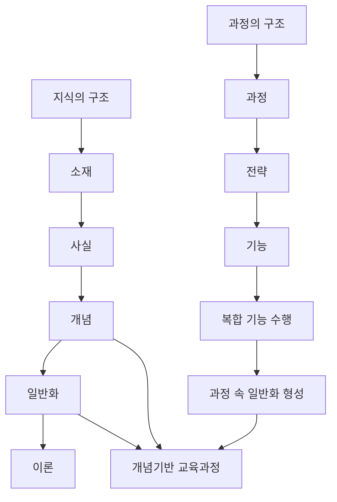

# 📖 개념기반 탐구학습의 실천 — 1장. 지식의 구조와 과정의 구조

> **저자**: H. Lynn Erickson, Lois A. Lanning, Rachel French
> **요약 날짜**: 2026-03-07
> **요약자**: 나

---

## 1. 한눈에 보기

1. 목적: 개념기반 교육과정의 이론적 토대인 `지식의 구조`와 `과정의 구조`를 함께 이해하기
2. 사용하는 질문: 개념적 질문, 관계 질문

1장의 핵심은 개념기반 학습이 `내용 지식`만으로도, `기능 훈련`만으로도 충분하지 않다는 점이다. 에릭슨은 지식의 구조를 `소재 → 사실 → 개념 → 일반화 → 이론`의 위계로 설명하고, 래닝은 과정의 구조를 `과정 → 전략 → 기능`의 틀로 설명한다. 중요한 것은 이 둘이 따로 움직이지 않는다는 점이다. 학생은 사실과 개념을 배우면서 일반화에 도달할 뿐 아니라, 읽기, 창작, 토론, 표현 같은 복합적인 기능을 수행하는 과정 속에서도 일반화를 형성할 수 있다. 결국 개념기반 교육과정은 지식의 구조와 과정의 구조가 함께 작동하도록 설계되어야 한다.

---

## 2. 핵심 개념 · 용어 정리

| 개념/용어 | 정의 · 설명 | 왜 중요한가 |
|-----------|-------------|-------------|
| 지식의 구조 | 에릭슨이 설명한 내용 지식의 위계 구조 | 학생이 사실을 넘어 일반화와 이론 수준의 이해로 나아가야 함을 보여 준다 |
| 소재(Topic) | 학습이 다루는 주제나 내용 영역 | 지식 탐구의 출발점이 된다 |
| 사실(Fact) | 특정한 사람, 사건, 시간, 장소, 현상에 관한 진술 | 개념 형성과 일반화의 재료가 된다 |
| 개념(Concept) | 여러 사실을 묶어 주는 추상적 범주나 아이디어 | 사실을 조직하고 전이 가능한 이해로 나아가게 한다 |
| 일반화(Generalization) | 개념과 개념 사이의 관계를 진술한 문장 | 개념기반 학습의 핵심 산출물이며 전이의 기반이 된다 |
| 이론(Theory) | 일반화가 더 넓고 체계적으로 조직된 수준 | *개념적 이해가 가장 높은 수준에서 구조화된 형태* |
| 과정의 구조 | 래닝이 설명한 수행과 사고의 구조 | 학습이 내용 습득만이 아니라 수행 과정 속 이해 형성임을 보여 준다 |
| 과정(Process) | 읽기, 쓰기, 탐구, 창작처럼 복합적으로 이루어지는 수행 활동 | 학생은 과정 속에서 의미를 구성하고 일반화를 형성할 수 있다 |
| 전략(Strategy) | 과정을 수행하기 위해 사용하는 접근 방식 | 과정을 더 의식적이고 효과적으로 수행하게 한다 |
| 기능(Skill) | 과정을 이루는 비교적 구체적 행동 요소 | 복합적인 과정 수행의 실제 단위가 된다 |
| 복합 기능 | 여러 기능이 결합된 수행 | *하나의 복합 기능 안에서도 개념과 일반화가 드러날 수 있음을 보여 준다* |
| 과정 기반 일반화 | 읽기, 예술 창작, 설득하기 같은 수행 과정 속에서 형성되는 일반화 | `지식만으로는 안 된다`는 1장의 핵심 주장을 가장 잘 보여 준다 |
| 설득 메시지 | 예술이나 미디어가 관중의 사고나 행동을 바꾸려는 표현 | 미술의 선전 사례처럼 과정과 개념이 만나는 장면을 보여 준다 |

---

## 3. 핵심 논지 구조

이 장의 흐름은 두 갈래다. 하나는 사실에서 개념, 일반화, 이론으로 올라가는 `지식의 구조`이고, 다른 하나는 과정, 전략, 기능을 통해 수행 속에서 일반화에 도달하는 `과정의 구조`다. 저자의 주장은 이 둘을 분리하지 말고 함께 보아야 진짜 개념기반 교육과정이 된다는 데 있다.

- `지식의 구조`는 학생이 무엇을 이해해야 하는지 보여 준다.
- `과정의 구조`는 학생이 어떻게 이해를 형성해 가는지 보여 준다.
- 따라서 개념기반 수업은 `내용 설계`와 `수행 설계`를 동시에 다뤄야 한다.
- 특히 과정 기반 일반화는 읽기, 쓰기, 창작, 해석처럼 복합적 수행 자체가 개념적 이해를 만들 수 있음을 보여 준다.

### 두 구조를 함께 볼 때 드러나는 점

- 사실은 개념으로 조직될 때 비로소 전이 가능성이 생긴다.
- 기능은 단순 연습이 아니라 일반화에 도달하는 경로가 될 수 있다.
- 지식의 구조만 강조하면 수업이 내용 암기에 머물 수 있다.
- 과정의 구조만 강조하면 개념적 초점 없이 활동만 남을 수 있다.

### 과정 기반 일반화 예시 메모

- `읽기`: 독자들은 텍스트에 대해 배우고 새로운 세부 정보를 발견하여 이해를 발전시켜 나간다.
- `예술`: 예술가들은 관중의 사고방식과 행동을 변화시키도록 설득하는 메시지를 창조할 수 있다.
- `미술의 선전`: `관중`, `강조`, `색상`, `설득`, `메시지`, `사고방식` 같은 개념이 결합되며 일반화로 이어질 수 있다.

---

## 4. 수업 적용 아이디어

### 💡 나의 아이디어

- 미술의 `선전` 단원은 1장의 핵심을 보여 주기 좋다. 단순히 작품을 만드는 것이 아니라, `관중`, `색상`, `강조`, `설득 메시지`를 개념으로 보고 그 관계를 일반화로 만들 수 있기 때문이다.
- 읽기 수업도 단순 기능 연습이 아니라 `이해는 세부 발견과 해석의 과정에서 발전한다`는 과정 기반 일반화로 설계해 볼 수 있겠다.

### 🤖 Claude 제안

- **아이디어 1: 읽기 전략에서 일반화 뽑아내기**
  - **적용 장면**: 국어 5~6학년 설명문 또는 이야기 읽기
  - **간단한 방법**: 학생이 밑줄 긋기, 질문 만들기, 핵심어 찾기 같은 읽기 전략을 사용한 뒤 `독자는 어떤 과정을 거치며 이해를 깊게 하는가?`를 정리하게 한다. 읽기 기능 연습을 과정 기반 일반화로 연결할 수 있다.

- **아이디어 2: 선전 포스터 분석과 제작**
  - **적용 장면**: 미술 5~6학년 시각문화 수업
  - **간단한 방법**: 기존 선전 포스터를 보고 `색상`, `구도`, `강조`, `관중`, `메시지`를 분석한 뒤, 직접 포스터를 제작하게 한다. 마지막에는 `시각적 요소는 관중의 사고와 행동에 영향을 준다` 같은 일반화를 도출하게 한다.

- **아이디어 3: 기능 수업을 개념 수업으로 바꾸기**
  - **적용 장면**: 전 교과 기능 중심 활동
  - **간단한 방법**: 발표, 토론, 실험, 글쓰기처럼 기능을 다루는 수업에서 `잘하는 법`만 가르치지 말고 `이 과정에서 어떤 개념이 작동하는가`를 함께 묻는다. 기능과 개념을 동시에 설계하는 연습이 된다.

---

## 5. 나의 생각 · 메모

### 읽으면서 정리된 점

- 1장은 `지식의 구조`와 `과정의 구조`를 따로 설명하지만, 결론은 둘을 함께 보라는 데 있다.
- `지식은 한 가지만으로는 안 된다`는 문제의식이 중요하다. 내용 이해와 과정 수행이 결합될 때 개념기반 수업이 성립한다.
- 특히 과정 기반 일반화가 더 어렵다. 개념을 뽑는 것보다, 복합적인 기능 수행 속에서 어떤 일반화가 나오는지를 읽어 내는 일이 더 까다롭게 느껴진다.

### 메모해 둘 점

- `미술: 선전` 사례는 과정의 구조를 수업 장면으로 이해하는 데 좋은 예시다.
- 나중에 원문 도표를 구하면 `지식의 구조`와 `과정의 구조` 도식을 이 장에 더 정확히 반영해 둘 필요가 있다.

> ✏️ _여기에 나중에 생각을 더 적어보세요._
>
> - 나는 수업에서 지식의 구조와 과정의 구조 중 어디에 더 치우쳐 있는가?
> - 기능을 가르칠 때 개념과 일반화를 함께 보고 있는가?
> - 과정 기반 일반화를 학생과 함께 만들려면 어떤 발문이 필요할까?

---

## 6. 연결 고리

- **3장 계획하기와의 연결**: 1장은 왜 단원 설계에서 `개념`과 `일반화`를 중심에 두어야 하는지 이론적 근거를 제공한다. 3장의 12단계 설계는 결국 1장의 구조를 실제 수업 설계 언어로 번역한 것이다.
- **8장 일반화하기와의 연결**: 1장에서 말한 지식의 구조와 과정의 구조는 8장에서 `좋은 일반화`를 만드는 기준으로 다시 구체화된다. 특히 과정 기반 일반화의 어려움은 8장에서 더 선명하게 드러난다.
- **9장 전이하기와의 연결**: 1장에서 일반화가 왜 중요한지 설명했다면, 9장은 그 일반화를 새로운 맥락으로 옮겨 보는 단계다. 즉 1장이 이론적 출발점이라면 9장은 실천적 검증 단계다.
