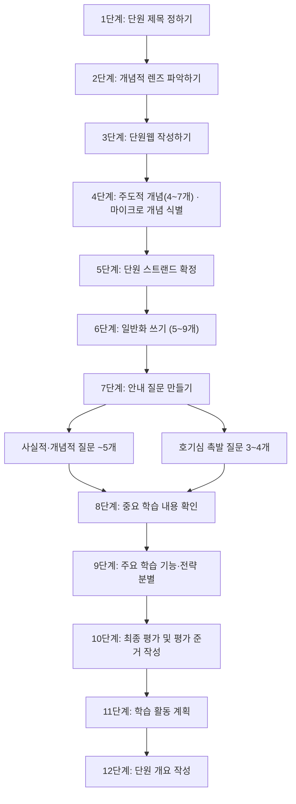
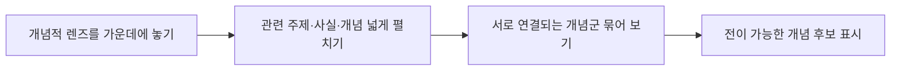

# 📖 개념기반 탐구학습의 실천 — 3장. 개념 기반 탐구의 계획

> **저자**: 카를라 마샬(Carla Marschall), 레이첼 프렌치(Rachel French)
> **요약 날짜**: 2026-03-07
> **요약자**: 나

---

## 1. 한눈에 보기

개념 기반 탐구 단원을 설계하기 위한 12단계 계획 절차를 제시하는 장이다. 단원 제목 정하기부터 시작하여 개념적 렌즈 파악, 단원웹 작성, 일반화 도출, 안내 질문 설계, 평가 및 학습 활동 계획까지 체계적인 흐름을 안내한다. 특히 단원웹이라는 도구를 활용하여 개념적 렌즈를 중심으로 관련 주제와 개념을 시각적으로 펼치고, 그중 전이 가능한 개념을 선별하는 과정이 핵심이다. 초등의 경우 6주 단원 기준으로 첫 1~2주에 개념 형성 전략을 통해 사전 지식을 활성화하고, 두 번째 주 끝 무렵부터 사례 연구 탐색으로 이어가는 운영 흐름을 제안한다.

---

## 2. 핵심 개념 · 용어 정리

| 개념/용어 | 정의 · 설명 | 왜 중요한가 |
|-----------|-------------|-------------|
| 개념적 렌즈(Conceptual Lens) | 단원 전체를 관통하는 상위 개념. IB에서는 주요 개념 목록에서 확인 가능 | 단원의 방향을 잡아주고, 사실적 학습을 개념적 수준으로 끌어올리는 초점 역할 |
| 단원웹(Unit Web) | 개념적 렌즈를 중심에 놓고 관련 주제·개념을 방사형으로 펼치는 시각적 도구 | 개념 간 관계를 한눈에 보며 전이 가능한 개념을 선별하는 데 도움 |
| 주도적 개념(Macro Concept) | 단원에서 중심이 되는 큰 개념. 4~7개 식별 | *단원의 뼈대를 형성하며, 일반화의 재료가 됨* |
| 마이크로 개념(Micro Concept) | *주도적 개념 아래에 놓이는 세부 개념* | *구체적 사실과 주도적 개념을 연결하는 다리 역할* |
| 단원 스트랜드(Unit Strand) | *단원 내 학습 내용을 조직하는 줄기/가닥* | *단원의 학습 흐름을 구조화하여 일반화 도출의 기반이 됨* |
| 일반화(Generalization) | 개념 간의 관계를 진술한 문장. 단원당 5~9개 작성 | 전이 가능한 이해의 핵심 도구. 단원 설계의 목적지 |
| 안내 질문(Guiding Questions) | 사실적·개념적 질문(약 5개) + 호기심 촉발 질문(3~4개)으로 구성 | 학생의 탐구를 이끌고 일반화 도달을 안내하는 장치 |
| 호기심 촉발 질문(Debatable Question) | 논쟁적이고 열린 질문. 3~4개 | *학생의 비판적 사고와 깊은 탐구를 자극* |
| 개념 형성 전략 | *사전 지식을 활성화하고 주도적 개념에 대한 초기 이해를 형성하는 교수 전략* | 초등 6주 단원의 첫 1~2주에 사용하여 탐구의 기반을 마련 |

---

## 3. 핵심 논지 구조

12단계는 크게 세 덩어리로 나눌 수 있다. **1~5단계**는 "무엇을 가르칠 것인가"를 구조화하는 단계(개념 선별), **6~7단계**는 "어디로 데려갈 것인가"를 설정하는 단계(일반화·질문), **8~12단계**는 "어떻게 가르치고 확인할 것인가"를 구체화하는 단계(내용·기능·평가·활동)다.

### 단원웹 작성 절차

단원웹은 개념적 렌즈를 중심에 두고 관련 주제, 사실, 개념을 넓게 펼친 다음, 그중 서로 연결되며 다른 맥락에도 옮겨 갈 수 있는 개념 후보를 가려내는 **탐색·선별 도구**다. 여기서 표시한 개념들이 곧바로 일반화 문장이 되는 것은 아니고, 이후 4~6단계에서 `주도적/마이크로 개념 식별 → 단원 스트랜드 정리 → 일반화 작성`으로 이어진다.

### 초등 6주 단원 운영 흐름

| 시기 | 단계 | 활동 |
|------|------|------|
| 1~2주 | 관계 맺기 및 집중하기 | 개념 형성 전략으로 사전 지식 활성화, 주도적 개념 초기 이해 형성 |
| 2주 끝~이후 | 사례 연구 탐색 | *구체적 사례를 통해 개념 간 관계를 탐구하기 시작* |

---

## 4. 수업 적용 아이디어

### 💡 나의 아이디어

- 3장의 핵심 도구는 결국 `단원웹`이다. 교사용 설계 문서로만 두지 말고, 학생용으로는 더 단순한 `개념 지도` 형태로 축소해서 함께 써볼 수 있겠다고 느꼈다.
- 12단계를 한 번에 다 하려 하기보다, 실제 수업 설계에서는 `렌즈 정하기 → 단원웹 → 일반화 초안 → 안내 질문`까지를 먼저 묶어 보는 편이 현실적이다.
- 초등에서는 특히 `첫 1~2주를 내용 진도 전개`가 아니라 `개념 형성 기간`으로 분명히 확보해야 이후 탐구가 흔들리지 않겠다는 생각이 들었다.

### 적용 예시

**아이디어 1: "우리 반 단원웹 함께 그리기" (개념적 렌즈 + 단원웹)**
- **적용 장면**: 사회 — 3~4학년 새 단원 도입 시
- **간단한 방법**: 칠판 가운데에 단원의 개념적 렌즈(예: "변화")를 크게 쓰고, 학생들에게 포스트잇으로 떠오르는 관련 단어를 붙이게 한다. 교사가 함께 분류하며 "이 중에서 다른 상황에도 쓸 수 있는 개념은?"을 묻고, 학생들이 선택한 개념에 밑줄을 긋는다. 이 과정 자체가 사전 지식 활성화이면서 동시에 단원웹의 축소판이 된다.

**아이디어 2: "일반화 씨앗 문장 만들기" (일반화 쓰기 연습)**
- **적용 장면**: 과학 — 5학년 단원 도입~2주차
- **간단한 방법**: 개념 형성 전략으로 주도적 개념(예: "적응", "환경")을 다룬 뒤, 모둠별로 "___은/는 ___에 영향을 준다" 같은 문장 틀을 주고 초벌 일반화를 써보게 한다. 이 씨앗 문장을 교실 벽에 게시해두고, 단원이 진행되면서 수정·보완하는 과정을 거치면 학생 스스로 일반화가 정교해지는 경험을 할 수 있다.

**아이디어 3: "안내 질문 분류 게임" (질문 유형 이해)**
- **적용 장면**: 국어/사회 — 4~6학년 탐구 학습 시
- **간단한 방법**: 교사가 단원 관련 질문 8~10개를 카드로 만들어 모둠에 배부한다. 학생들은 "답이 정해진 질문 / 생각해야 하는 질문 / 논쟁할 수 있는 질문"으로 분류한다. 분류 후 "우리가 가장 탐구하고 싶은 질문은?"을 고르게 하면, 사실적·개념적·호기심 질문의 차이를 체험적으로 이해하게 된다.

---

## 5. 나의 생각 · 메모

### 읽으면서 든 생각

- 3장은 탐구 수업의 활동 아이디어를 주는 장이라기보다, **앞 장과 뒤 장 전체를 묶는 설계 프레임**을 제시하는 장으로 읽혔다.
- 가장 어려운 단계는 역시 `일반화 쓰기`와 `안내 질문 만들기`다. 개념을 뽑아내는 것보다, 개념 간 관계를 전이 가능한 문장으로 만드는 일이 훨씬 어렵다.
- 단원웹은 교사에게는 설계 도구이지만, 학생에게는 그대로 쓰기보다 `축소판 개념 지도`나 `공동 브레인스토밍 보드`로 바꾸어 적용하는 편이 현실적이다.
- 초등 6주 단원 운영 제안이 인상적이었다. 초반 1~2주를 사전 지식 활성화와 개념 형성에 충분히 쓰지 않으면, 이후 사례 탐색이 사실 나열로 흘러갈 가능성이 크다.

### 스스로 점검할 질문

- 지금 내가 만드는 단원 계획에는 `개념적 렌즈`가 정말 중심에 놓여 있는가, 아니면 활동 목록만 먼저 쌓고 있는가?
- 단원웹에서 밑줄 그은 개념들이 정말 다른 맥락으로 전이 가능한 개념인가?
- 내가 만든 안내 질문이 사실 확인에 머무르지 않고, 학생을 일반화로 이끄는 구조를 가지고 있는가?

---

## 6. 연결 고리

- **4장 관계맺기와의 연결**: 3장에서 설계한 단원 계획, 특히 `개념적 렌즈`, `안내 질문`, `초기 개념 형성`의 자리가 4장에서 실제 수업 도입 전략으로 구현된다. 3장이 설계도라면 4장은 첫 시공 단계다.
- **5장 집중하기와의 연결**: 3장의 초반 설계가 `무슨 개념에 초점을 맞출지`를 정해 준다면, 5장은 그 개념을 학생이 실제로 붙잡도록 만드는 장이다. 즉 계획에서 정한 주도적 개념이 5장에서 본격적으로 선명해진다.
- **6장 일반화 쓰기와의 연결**: 3장 6단계에서 제시된 일반화 작성은 6장에서 더 구체적인 기준과 사례로 확장된다. 3장은 일반화를 설계 위치에 올려놓고, 6장은 그 문장 자체를 정교화한다.
- **전체 구조에서의 위치**: 3장은 탐구의 `계획 단계`로, 이후 4~9장에서 다루는 탐구 실행(관계맺기 → 집중하기 → 탐색하기 → 정리하기 → 일반화하기 → 전이하기)의 전체 밑그림을 잡아 주는 허브 역할을 한다.
