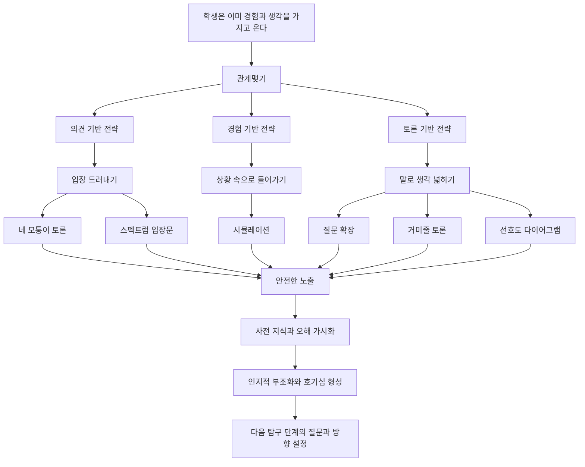

# 📖 개념기반 탐구학습의 실천 — 4. 관계맺기

> **저자**: 카를라 마샬(Carla Marschall), 레이첼 프렌치(Rachel French)
> **요약 날짜**: 2026-03-07
> **요약자**: 나

---

## 1. 한눈에 보기

1. 목적: 개념과 학생의 연결
2. 안내 질문: 사실적 질문, 개념적 질문, 호기심 촉발 질문

4장의 핵심은 단원 초입에서 학생의 머릿속에 이미 들어 있는 생각, 경험, 오해, 직감을 밖으로 꺼내 새 학습과 연결하는 것이다. 관계맺기는 단순한 흥미 유발이 아니라, **학생이 이미 알고 있다고 믿는 것과 앞으로 배우게 될 개념 사이에 접점을 만드는 설계 단계**다.

이 단계의 목적은 세 가지다. 첫째, 학생이 "이 단원이 나와 무슨 관련이 있지?"에 답하게 하는 **연결성 확보**. 둘째, 기존 생각이 흔들리도록 만드는 **인지적 부조화**. 셋째, 아직 불완전한 생각도 말해볼 수 있게 하는 **안전한 노출**이다.

책은 이를 위해 세 가지 전략군을 제시한다.
- **의견 기반 전략**: 입장을 먼저 드러내게 한다.
- **경험 기반 전략**: 몸으로 겪거나 상황 속에 들어가게 한다.
- **토론 기반 전략**: 말과 질문을 통해 생각을 확장하게 한다.

즉, 관계맺기는 "배우기 전에 묻는 시간"이 아니라, **배움이 일어날 조건을 만드는 시간**이다.

---

## 2. 핵심 개념 · 용어 정리

| 개념/용어 | 정의 · 설명 | 왜 중요한가 |
|-----------|-------------|-------------|
| 관계맺기 | 단원 시작에서 학생의 사전 지식, 경험, 신념을 새 학습과 연결하는 단계 | 이후 탐구의 출발점을 만든다 |
| 인지적 부조화 | 기존 생각과 새 정보가 부딪힐 때 생기는 어긋남과 불편함 | 탐구해야 할 이유를 만든다 |
| 안전한 노출 | 틀려도 괜찮은 구조 안에서 학생이 자기 생각을 드러내는 상태 | 오해와 선개념을 실제로 볼 수 있다 |
| 의견 기반 전략 | 학생의 판단, 찬반, 선호, 신념을 먼저 드러내게 하는 전략군 | 빠르게 입장 차이를 보이게 하고 부조화를 만들기 좋다 |
| 네 모퉁이 토론 | 하나의 진술문에 대해 동의 정도별로 위치를 정하고 이유를 말하는 활동 | 입장 차이를 즉시 가시화한다 |
| 스펙트럼 입장문 | 흑백 찬반이 아니라 연속선 위에서 자신의 위치를 정하게 하는 활동 | 생각의 강도와 미세한 차이를 드러낸다 |
| 경험 기반 전략 | 학생이 어떤 상황을 직접 겪거나 체험적으로 접하게 하는 전략군 | 개념을 설명보다 경험으로 먼저 만나게 한다 |
| 시뮬레이션 | 실제 상황을 축소·재현하여 학생이 역할, 조건, 제약을 체험하는 활동 | 추상 개념을 피부감 있는 문제로 바꾼다 |
| 토론 기반 전략 | 질문과 대화를 통해 생각을 확장·재구성하게 하는 전략군 | 학생의 언어로 개념의 씨앗을 형성하게 한다 |
| 질문 확장 | 한 학생의 응답을 끝내지 않고 "왜?", "항상?", "반대 사례는?"처럼 밀어 확장하는 방식 | 표면적 답을 개념적 사고로 밀어 올린다 |
| 거미줄 토론 | 학생들끼리 발언을 이어 가며 대화의 연결망을 만드는 토론 방식 | 교사 중심 문답이 아닌 학생 간 의미 협상을 만든다 |
| 선호도 다이어그램 | 여러 선택지나 기준을 비교하며 무엇을 더 중요하게 보는지 시각화하는 활동 | 판단 기준과 가치 우선순위를 드러낸다 |

---

## 3. 핵심 논지 구조

이 장의 구조는 단순하다. 학생의 생각을 먼저 드러내고, 그 생각을 흔들고, 그 흔들림을 다음 탐구의 동력으로 바꾸는 것이다. 차이는 "무엇으로 꺼내느냐"에 있다. 의견 기반은 입장으로, 경험 기반은 체험으로, 토론 기반은 언어와 상호작용으로 학생의 생각을 밖으로 꺼낸다.

전략군별로 보면 역할이 조금씩 다르다.
- **의견 기반 전략**은 단원 초반에 빠르게 입장 차이를 드러내고 싶을 때 적합하다. 오해를 일부러 건드리기 좋다.
- **경험 기반 전략**은 학생이 아직 개념어를 모르더라도 상황을 먼저 느끼게 할 수 있다. 추상적인 주제를 현실감 있게 만든다.
- **토론 기반 전략**은 이미 나온 생각을 더 정교하게 연결하고, 기준과 근거를 언어화하게 만든다.

### 전략별 정리

5장의 `전략 1, 2, 3`처럼 4장도 전략군별 공통 흐름으로 다시 보면 더 선명하다. 내가 이해한 4장의 흐름은 **드러내기 → 흔들기 → 연결하기**다. 다만 무엇으로 생각을 꺼내느냐에 따라 활동 묶음이 달라진다.

#### 전략 1: 의견 기반 전략

> **진술문 제시 → 위치 정하기 → 이유 말하기 → 입장 차이 보기 → 오해 흔들기**

- `네 모퉁이 토론`: 찬반이나 동의 정도를 네 구역으로 나누어 빠르게 입장을 드러내게 한다.
ex) `현재 살아 있는 동물들은 가장 강한 동물이다`
 -> 학생이 네 구역(매우 그렇다, 그렇다, 아니다, 매우 아니다) 중 하나로 이동한다.
 -> 왜 그 자리에 섰는지 한 문장으로 말한다.
 -> 서로 다른 구역의 이유를 듣고, `강함`의 기준이 제각각임을 확인한다.
 -> 여기서 인지적 부조화가 생기며 다음 탐구 질문이 열린다.
- `스펙트럼 입장문`: 맞다/아니다를 넘어서 생각의 강도와 경계 사례를 드러낸다.
ex) `키가 큰 사람은 대체로 발도 크다`
 -> 학생이 연속선 위에 자기 위치를 정한다.
 -> 양 끝만 아니라 중간 위치의 이유를 말하게 한다.
 -> `항상 그런가?`, `예외는 없는가?`를 묻는 순간 단순 직감이 흔들린다.

#### 전략 2: 경험 기반 전략

> **상황 만들기 → 직접 겪기 → 반응 드러내기 → 경험을 개념으로 연결하기**

- `시뮬레이션`: 실제 상황을 축소해 재현하고 학생이 그 안에서 조건과 결과를 몸으로 겪게 한다.
ex) 감염 확산
 -> 몇몇 학생에게만 시작 카드나 표식을 준다.
 -> 악수, 이동, 접촉 규칙에 따라 표식이 퍼지게 한다.
 -> 활동 후 `누가 잘못했는가`보다 `어떤 조건 때문에 퍼졌는가`를 묻는다.
 -> 학생은 경험을 `접촉`, `확산`, `예방`, `조건` 같은 개념으로 연결한다.
ex) 월드 비전 아동 노동 시뮬레이션-인권
ex) 옥스팜 배고픈 연회장-부의 분배

- `See-Think-Wonder`: 경험 기반과 토론 기반을 잇는 루틴으로, 관찰을 개념적 질문으로 바꿔준다.
ex) 옛날 사진과 현재 사진 비교
 -> See: 무엇이 보이는지 말한다.
 -> Think: 왜 달라졌는지 해석한다.
 -> Wonder: 더 알고 싶은 질문을 만든다.
 -> 관계맺기 단계에서 학생의 경험과 추론을 동시에 드러내기 좋다.

#### 전략 3: 토론 기반 전략
> **학생의 주제와 관련된 여러가지 생각을 끌어내고 싶을 때, 딱히 토론이라기보다는 생각 꺼내기라고 이름 붙이는 게 좋겠음.**

- `질문 확장`: 학생들의 초기 질문 수집하고, 전반적인 구조 확인하기
my thinking. 별로다. 안 쓸 것 같다.
tip. 어린 학생은 질문보다 다음과 같은 서술문이 더 편할 수 있다. 내가 이 단원에서 궁금한 것은 ~이다.
ex)
`공정한 규칙은 모두에게 똑같아야 하나요?`
`태어날 때부터 조건이 다른 것에 대한 고려를 한다면, 그것은 평등한 걸까요?`
 -> 학생들이 던진 여러가지 질문을 키워드별로 분류한다.

- `거미줄 토론`: 학생 발언이 학생 발언을 잇게 하여 생각의 연결망을 만든다.
ex) `힘이 세면 오래 살아남을 수 있을까?`
 -> 교사는 최소한으로 개입하고 학생끼리 의견을 잇는다.
 -> 앞사람의 말을 이어받거나 반박하며 기준이 분화된다.
 -> 사전 지식이 개인 머릿속에서 집단의 개념 자원으로 바뀐다.

- `선호도 다이어그램`: 사전 지식을 개념적 범주로 수집하고 구성하는 방법
ex) `정부가 시장 개입을 한 사례를 말해봅시다.`
(원 질문: `정부가 시장에 어떻게 개입하는가?`)
 -> 각자 자신의 답을 한다.
 -> 모둠별로 이것들을 분류한다.
 -> 다른 모둠의 발표를 듣고, 알게 된 점/다른 팀의 발표에서 놀라운 것 또는 비슷한 점이 있는지 말해보게 한다.

---

## 4. 수업 적용 아이디어

### 💡 나의 아이디어
(아직 작성하지 않음 — 나중에 추가하세요)

### 🤖 Claude 제안

- **아이디어 1: "강한 동물은 살아남는다?" 네 모퉁이 토론**
  - **적용 장면**: 과학 3~4학년 `동물의 생활` 도입
  - **간단한 방법**: `현재 살아 있는 동물들은 가장 강한 동물이다`라는 진술문을 제시하고 네 모퉁이로 이동하게 한다. 이동 이유를 들은 뒤, "강함은 힘만 뜻할까?"라는 질문 확장으로 오해를 흔든다.

- **아이디어 2: 감염 확산 시뮬레이션**
  - **적용 장면**: 과학 3~4학년 `감염병과 건강한 생활` 도입
  - **간단한 방법**: 접촉에 따라 색 카드나 도장을 주고받게 하여 감염 확산을 시뮬레이션한다. 활동 뒤 "누가 잘못해서가 아니라 어떤 조건 때문에 빨리 퍼졌는가?"를 묻게 하면 생활 습관, 접촉, 예방의 개념으로 연결된다.

- **아이디어 3: 거미줄 토론으로 '공정함' 드러내기**
  - **적용 장면**: 도덕 또는 학급 규칙 만들기 도입
  - **간단한 방법**: `공정한 규칙은 모두에게 똑같아야 할까?`를 던지고 학생끼리만 발언을 이어가게 한다. 교사는 중간중간 질문 확장만 넣어 `똑같음`, `필요`, `배려` 같은 개념이 나오도록 돕는다.

- **아이디어 4: 선호도 다이어그램으로 판단 기준 찾기**
  - **적용 장면**: 사회 5학년 `지역 문제 해결` 또는 실과 프로젝트 도입
  - **간단한 방법**: 
  `네가 아는 지역 문제에는 어떤 것들이 있을까?`
  학생들은 각자의 답을 포스트잇에 적는다 ->  모둠 안에서 각자 스스로 `비용`, `안전`, `편리성`, `환경` 범주로 분류한다. -> 각 모둠은 발표하고, 배운 점, 다른 조의 발표에서 놀라운 점, 우리 조와의 공통점까지 발표해보게 한다.

### 전략 선택 기준

- **오해를 바로 흔들고 싶을 때**: 네 모퉁이 토론, 스펙트럼 입장문
- **개념을 몸으로 먼저 느끼게 하고 싶을 때**: 시뮬레이션
- **주제와 관련하여 학생의 여러가지 생각을 끌어내고 싶을 때**: 질문 확장, 거미줄 토론, 선호도 다이어그램

---

## 5. 나의 생각 · 메모

> ✏️ _여기에 나중에 생각을 적어보세요._
>
> - 나는 관계맺기를 지금까지 "흥미 유발" 정도로만 이해하지 않았는가?
> - 내 수업 도입은 학생의 사전 지식과 오해를 실제로 드러내고 있는가?
> - 내가 자주 쓰는 도입 활동은 의견 기반, 경험 기반, 토론 기반 중 어디에 치우쳐 있는가?
> - 학생이 말하기 어려워하는 이유를 분위기 탓만 했지, 활동 구조 문제로 보지 않았는가?

---

## 6. 연결 고리

- **5장과의 연결**: 4장에서 생각을 끌어냈다면, 5장에서는 그 생각들 가운데 어떤 개념에 초점을 맞출지 더 선명하게 붙잡는다. 관계맺기가 문을 여는 단계라면, 5장은 시선을 모으는 단계다.
- **8장과의 연결**: 4장에서 드러난 사전 지식, 오해, 입장 차이는 이후 일반화하기에서 패턴을 찾고 개념 간 관계를 문장으로 만드는 재료가 된다.
- **9장과의 연결**: 단원 초반에 드러난 학생의 초기 입장은 나중에 전이 단계에서 다시 비교할 기준점이 된다. 처음 생각과 나중 생각의 변화가 보일수록 학습의 깊이도 더 분명해진다.
