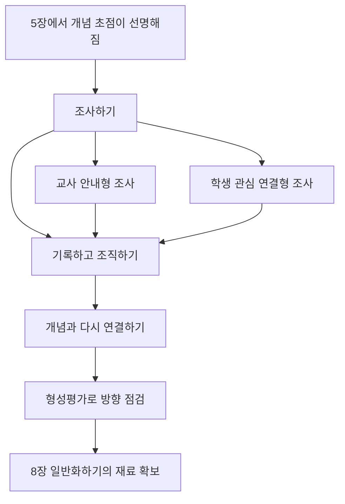

# 📖 개념기반 탐구학습의 실천 — 6. 조사하기

> **저자**: 카를라 마샬(Carla Marschall), 레이첼 프렌치(Rachel French)
> **요약 날짜**: 2026-03-07
> **요약자**: 나

---

## 1. 한눈에 보기

1. 목적: 예를 탐색하여 개념과 연결하고, 관련 학습 기능을 익히기
2. 안내 질문: 사실적 질문

6장의 핵심은 `조사`를 사실 수집 자체로 이해하지 말고, **단원의 개념을 맥락 속 사실적 예와 연결하는 단계**로 보아야 한다는 점이다. 그래서 학생은 다양한 예를 찾아보되, 단순히 많이 모으는 데서 끝나지 않고 `이 예가 어떤 개념과 연결되는가`를 계속 따져야 한다. 또 이 장은 조사 단계에서 학생이 무엇을 `배우는가`만큼이나, 무엇을 `할 수 있게 되는가`를 강조한다. 즉 조사하기는 내용 탐색 단계이면서 동시에 질문 만들기, 자료 찾기, 기록하기, 해석하기, 공유하기 같은 기능을 키우는 단계다. 교사 주도와 학생 주도의 비율은 상황에 따라 달라질 수 있지만, 어느 경우든 조사의 목표는 `사실의 축적`이 아니라 `개념 이해를 위한 재료 확보`다.

---

## 2. 핵심 개념 · 용어 정리

| 개념/용어 | 정의 · 설명 | 왜 중요한가 |
|-----------|-------------|-------------|
| 조사하기 | 단원 개념을 더 선명하게 보기 위해 사실적 예, 자료, 사례를 찾아 탐색하는 단계 | 조사를 통해 이후 일반화와 전이의 재료를 확보한다 |
| 사실적 예 | 특정 시간, 장소, 사람, 사건, 현상에 붙어 있는 구체적 사례 | 개념을 공중에 뜬 말이 아니라 실제 맥락 속에서 보게 한다 |
| 사실적 질문 | 누가, 언제, 어디서, 무엇을, 어떻게 했는지 묻는 질문 | 조사 단계의 출발점을 만들지만, 그 자체가 최종 목표는 아니다 |
| 개념 연결 | 찾은 사실적 예를 단원의 핵심 개념이나 렌즈와 다시 묶는 일 | 조사 활동이 `자료 모으기`로 흩어지지 않게 붙잡아 준다 |
| 학습 기능 개발 | 질문 형성, 관찰, 계획, 자료 수집, 기록, 해석, 공유 같은 수행 능력을 기르는 것 | 이 장이 단순 읽기 활동이 아니라 `할 수 있게 만드는 단계`라는 점을 보여 준다 |
| 주도성 스펙트럼 | 교사가 조사 범위를 강하게 안내하는 방식부터 학생이 관심 기반으로 조사하는 방식까지 이어지는 폭 | 같은 조사하기라도 수업 목적과 학생 수준에 따라 설계가 달라진다 |
| 교사 안내형 조사 | 교사가 자료 범위, 질문, 조사 경로를 비교적 분명하게 정해 주는 조사 방식 | 초등 단계에서 길을 잃지 않게 하거나 핵심 개념에 빨리 접근하게 할 때 유용하다 |
| 학생 관심 연결형 조사 | 학생이 관심 있는 사례를 고르되, 공통 개념으로 다시 묶어 내는 조사 방식 | 참여도와 주도성을 높이면서도 개념 학습과 연결할 수 있다 |
| 자료 생태계 | 출판 자료, 테크놀로지, 영상 자료, 체험 방법, 인적 자원처럼 조사에 동원할 수 있는 자원 묶음 | 조사 방법을 한 가지 자료형에만 가두지 않게 해 준다 |
| 형성평가 | 조사 활동 중간중간 학생의 방향, 사고 과정, 자료 사용, 연결 수준을 점검하고 피드백하는 평가 | 조사가 엉뚱한 사실 수집으로 흐르지 않도록 계속 조정해 준다 |

### 학습자를 위한 기능 목록 조사 메모

| 출처                                 | 기능 목록                                                                                                        | 이 장에서 어떻게 읽으면 좋은가                                                                                                                |
| ---------------------------------- | ------------------------------------------------------------------------------------------------------------ | -------------------------------------------------------------------------------------------------------------------------------- |
| Harlen & Jelly (1997)              | 관찰하기, 질문하기, 가설 세우기, 예측하기, 조사하기, 해석하기, 의사소통하기                                                                 | 조사 단계를 `탐구 기능의 묶음`으로 보는 관점이 분명하다. *직접 공개 원문 대신, 이를 요약해 재인용한 Ash 자료를 통해 목록을 확인했다.*                                                |
| IB PYP (2009)                      | 사회적 기능, 의사소통 기능, 사고 기능, 연구 기능, 자기관리 기능. 이 중 연구 기능은 질문 형성, 관찰, 계획, 자료 수집, 자료 기록, 자료 조직, 자료 해석, 연구 결과 제시로 제시된다 | 책의 `조사하기에서 기능을 함께 가르쳐야 한다`는 주장과 가장 직접적으로 맞닿는다. 조사 단계만 따로 떼어 보면 특히 `연구 기능`이 핵심이다                                                  |
| ISTE Standards for Students (2016) | 자기주도 학습, 디지털 시민성, 지식 구성, 혁신적 설계, 컴퓨팅 사고, 창의적 의사소통, 글로벌 협업                                                    | 디지털 환경에서 조사하기를 본다면 특히 `Knowledge Constructor`, `Computational Thinker`, `Creative Communicator`, `Global Collaborator`가 강하게 연결된다 |

출처별 기능을 이번 장의 맥락으로 다시 묶으면, 조사 단계에서 학생에게 필요한 기능은 크게 아래처럼 보인다.

1. **질문 만들기**: 무엇을 알고 싶은지 분명히 하기
2. **자료 찾기와 고르기**: 다양한 출처에서 관련 자료를 찾고 적절성을 판단하기
3. **기록하고 조직하기**: 찾은 사실을 흩어놓지 않고 비교 가능한 형태로 남기기
4. **해석하고 연결하기**: 사실적 예에서 패턴, 관계, 개념 연결을 읽어 내기
5. **공유하고 피드백받기**: 조사 결과를 말과 글, 시각 자료로 표현하고 수정하기

---

## 3. 핵심 논지 구조

이 장의 흐름은 `무작정 찾기`가 아니라 `묻기 → 찾기 → 기록하기 → 개념에 다시 붙이기`다. 즉 조사 단계는 사실적 예를 넓게 모으는 단계이면서도, 동시에 그 예들이 나중에 일반화로 이어질 수 있도록 정리하고 연결하는 단계다.

전략군별로 보면 역할 차이가 있다.
- **교사 안내형 조사**는 조사 범위와 자료를 좁혀 주어 학생이 핵심 개념에서 벗어나지 않게 한다.
- **학생 관심 연결형 조사**는 학생의 흥미를 살리되, 마지막에는 공통 개념으로 다시 묶어 내게 한다.
### 전략별 정리

내가 이해한 6장의 흐름은 찾기 → 묶기 → 연결하기**다. 차이는 누가 조사 범위를 더 많이 쥐고 있는지, 그리고 조사 결과를 어떤 기능 발달과 함께 보느냐에 있다.

#### 전략 1: 교사 안내형 조사

> **교사가 질문 범위 정하기 → 교사가 자료 범위 좁히기 → 관련 예 찾기 → 개념에 다시 연결하기**

- `조사 경로 제시`: 교사가 어디서 무엇을 봐야 하는지 큰 틀을 먼저 정해 주는 방식
ex) `서식지에 따라 동물의 생김새는 어떻게 달라지는가?`
 -> 교사가 `사막 / 극지 / 숲 / 하천`처럼 비교 범주를 먼저 제시한다.
 -> 학생은 각 범주에서 한두 사례씩만 조사하여 자료 과부하를 줄인다.
 -> 조사 기록지에는 `사실`, `보이는 특징`, `관련 개념` 칸을 두어 단순 복사 붙여넣기를 막는다.
 -> 마지막에는 `환경`, `기능`, `적응` 같은 개념어로 다시 정리하게 한다.
- `핵심 자료 선별`: 자료 생태계 전체를 다 쓰게 하기보다 이번 조사에 맞는 자료형을 골라 주는 방식
ex) `같은 사건을 서로 다른 관점에서 보면 무엇이 달라지는가?`
 -> 교사가 두세 개의 상반된 자료만 골라 제시한다.
 -> 학생은 자료 수를 늘리는 대신, 관점 차이를 읽어 내는 데 집중한다.
 -> 이때 조사 목표는 `많이 찾기`가 아니라 `비교 가능한 예를 찾기`가 된다.

#### 전략 2: 학생 관심 연결형 조사

> **관심 사례 고르기 → 공통 개념 찾기 → 사례 비교하기 → 개념 언어로 묶기**

- (1) `관심 기반 사례 선택`: 학생이 스스로 조사 대상을 고르되, 공통 질문은 함께 유지하는 방식
ex) `내가 고른 사례에서 변화는 무엇을 만들었는가?`
 -> 어떤 학생은 스포츠 규칙 변화를, 어떤 학생은 교통수단 변화를, 어떤 학생은 도시 변화를 고른다.
 -> 교사는 사례가 달라도 공통 질문은 유지하게 하여 나중에 비교가 가능하도록 한다.
 -> 학생은 자기 사례를 설명한 뒤, 다른 모둠과 비교하며 `변화`, `기능`, `영향` 같은 공통어를 뽑는다.
 -> 관심에서 출발하지만 끝은 개념적 공통점으로 정리된다.
- (2) `네트워크형 비교`: (1)을 바탕으로, 연결해 더 넓은 패턴을 보게 하는 방식
ex) `각자 조사한 사례를 연결하면 어떤 공통 구조가 보이는가?`
 -> 모둠별 결과를 칠판이나 디지털 보드에 모은다.
 -> 서로 다른 사례 사이에 선을 그으며 비슷한 패턴을 찾게 한다.
 -> 이 과정에서 학생은 `내 사례만 말하기`를 넘어서 `사례 사이 관계 읽기`로 이동한다.

---

## 4. 수업 적용 아이디어

### 💡 나의 아이디어
(아직 작성하지 않음 — 나중에 추가하세요)

### 🤖 Claude 제안

**1. 조사 단계 형성평가 조합 5종**
1. **관찰 × 체크리스트**: 교사가 조사 중 학생을 돌며 `질문이 조사 가능한가`, `출처를 한 가지에만 의존하지 않는가`, `기록이 누락되지 않는가`를 빠르게 본다.
2. **토론 × 일화 메모**: 모둠이 찾은 사실을 서로 설명할 때 교사가 `개념어를 스스로 쓰는지`, `사례 비교가 되는지`를 짧게 메모한다.
3. **상의 × 루브릭**: 모둠별 짧은 컨퍼런스를 하며 `무엇을 찾았는가`보다 `왜 그 자료가 질문에 맞았는가`를 묻고 루브릭 기준으로 피드백한다.
4. **출구카드 × 자기 평가**: 수업 끝에 `오늘 찾은 사실 1개`, `연결한 개념 1개`, `다음에 보완할 기능 1개`를 적게 한다.
5. **학생 작품 샘플 × 동료 평가**: 조사 기록지나 슬라이드 초안을 서로 바꾸어 보고 `자료의 신뢰도`, `조직 방식`, `개념 연결 문장`을 기준으로 피드백한다.

---

## 5. 나의 생각 · 메모

### 읽으면서 든 생각

- `사실적 예를 조사하는 것 자체가 목적은 아니다`라는 경고는 분명히 필요하다. 이 장이 말하려는 요지는 결국 `예를 통해 개념을 더 잘 보라`는 쪽으로 읽힌다.
- 다만 읽는 입장에서는 주도성 스펙트럼이나 기능 개발 이야기가 조금 길게 느껴진다. 방향 자체는 맞는데, "그래서 실제 수업에서 무엇을 어떻게 보라는가"를 더 빨리 보여 주면 좋겠다는 생각이 든다.
- 특히 `기능을 길러라`는 말은 너무 쉽게 맞는 말이 되어 버릴 수 있어서, 결국은 출처별 기능 목록처럼 더 구체적인 틀이 있어야 수업 설계에 바로 쓸 수 있다.
- 이번 장은 조사 방법 자체를 많이 늘리는 것보다, 조사 결과를 어떻게 개념과 연결할지 틀을 주는 쪽이 더 중요하게 느껴진다.

### 정리해 둔 문장

> 교과서는 기억해야 할 사실로 정보를 제시한다. 사실은 아이디어를 탐구하고 연결을 찾도록 해야 한다.

이 문장은 이번 장의 방향을 가장 잘 요약한다. 조사 단계는 `사실 확인`에서 멈추지 않고, 사실을 발판 삼아 `아이디어와 연결`로 넘어가야 한다는 뜻으로 읽힌다.

---

## 6. 연결 고리

- **5장 집중하기와의 연결**: 5장에서 개념의 경계와 속성을 더 선명하게 붙잡았다면, 6장에서는 그 개념이 실제 맥락에서 어떻게 드러나는지 사실적 예를 통해 살펴본다. 즉 5장이 `무엇을 볼 것인가`를 정리하는 단계라면, 6장은 `그 개념을 어디서 어떻게 찾을 것인가`를 다루는 단계다.
- **8장 일반화하기와의 연결**: 6장에서 모은 사실적 예와 조사 결과는 8장에서 일반화를 만들 때 재료가 된다. 조사 단계가 빈약하면 일반화 단계는 공허해지고, 반대로 조사한 예를 개념과 잘 연결해 두면 이후 패턴과 관계를 찾기가 쉬워진다.
- **형성평가와의 연결**: 이번 장에서의 형성평가는 단순한 확인 문제가 아니라, `지금 학생이 조사라는 이름으로 무엇을 하고 있는가`를 확인하는 장치다. 이 점은 이후 일반화 문장이나 전이 과제의 질에도 직접 영향을 준다.

