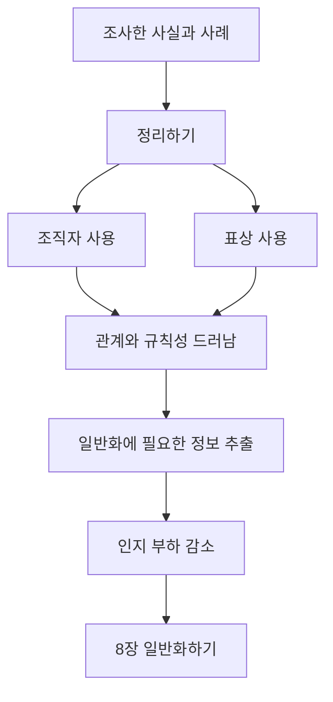

# 📖 개념기반 탐구학습의 실천 — 7. 정리하기

> **저자**: 카를라 마샬(Carla Marschall), 레이첼 프렌치(Rachel French)
> **요약 날짜**: 2026-03-07
> **요약자**: 나

---

## 1. 한눈에 보기

1. 목적: 아이디어들 사이의 관계를 보이게 하고, 일반화에 필요한 정보를 추출하도록 돕기
2. 안내 질문: 사실적 질문, 개념적 질문

7장 "정리하기"는 조사한 정보나 사례를 단순히 모아 두는 단계가 아니라, **정보들 사이의 관계를 드러내고 일반화할 수 있을 만큼 의미 있게 구조화하는 단계**다. 이 단계가 필요한 이유는 세 가지로 정리된다. 첫째, 흩어진 사실들 사이의 연결을 보이게 하기 위해서다. 둘째, 다음 단계인 일반화하기에서 쓸 핵심 정보만 추출하기 위해서다. 셋째, 학생이 한꺼번에 너무 많은 정보를 머릿속에 붙잡고 있지 않아도 되도록 하여 **인지 부하를 줄이기** 위해서다.

여기서 인지 부하를 줄인다는 말은, 학생이 모든 정보를 머릿속에서 동시에 비교하고 정리하려 하지 않아도 되게 만든다는 뜻으로 이해했다. 예를 들어 비교표, 흐름도, 문장 틀, 교실 벽의 일반화 기록처럼 **생각의 일부를 눈앞 구조물에 바깥화**하면, 학생은 기억 자체보다 관계 파악에 더 에너지를 쓸 수 있다.

또 이 장은 정리하기가 단순 분류 기술이 아니라 **표상과 사고 확장**의 문제라는 점을 강조한다. 곰돌이 젤리로 민주주의와 독재 정부를 설명하는 예처럼, 학생이 개념을 다른 방식으로 나타내는 순간 교사는 사실적 질문과 개념적 질문으로 사고를 더 넓히거나 흔들 수 있다. 즉 정리하기는 `보여 주기 좋게 정리하기`가 아니라, **개념 이해를 더 깊게 만드는 사고 도구 사용하기**에 가깝다.

---

## 2. 핵심 개념 · 용어 정리

| 개념/용어 | 정의 · 설명 | 왜 중요한가 |
|-----------|-------------|-------------|
| 정리하기 | 조사한 정보, 사례, 생각을 구조화하여 관계와 규칙성을 드러내는 단계 | 일반화로 가기 전 의미 있는 패턴을 보게 한다 |
| 아이디어 간 관계 | 사실, 사례, 개념 사이의 연결, 차이, 순서, 영향 관계 | 일반화는 결국 이런 관계를 문장으로 진술한 것이기 때문이다 |
| 정보 추출 | 많은 자료 중 일반화에 필요한 핵심 정보만 가려내는 것 | 모든 사실이 아니라 의미 있는 사실을 붙잡게 한다 |
| 인지 부하 | 학습자가 한꺼번에 처리해야 하는 정보량 때문에 생기는 사고 부담 | 정리 도구를 쓰면 기억 부담이 줄고 관계 파악에 집중할 수 있다 |
| 표상(Representation) | 개념이나 이해를 그림, 말, 역할극, 모형, 글 등 다른 형태로 나타내는 것 | *표상이 바뀌면 학생이 무엇을 이해했고 무엇을 놓쳤는지 더 잘 드러난다* |
| 조직자(Organizer) | 비교표, 흐름도, 네트워크, 시각 메모처럼 정보를 구조화하는 도구 | 복잡한 정보를 눈에 보이게 만들어 패턴을 찾게 한다 |
| 규칙성 | 여러 정보 사이에서 반복해서 나타나는 공통 구조 | 일반화의 재료가 된다 |
| 교차 비교 차트 | 개념과 개념, 개념과 사례, 질문과 사례를 나란히 비교하는 표 | 차이와 공통점을 동시에 보게 한다 |
| 교환 카드 | 사례 연구의 핵심 정보를 카드 앞뒤에 간단히 정리하는 방식 | 어린 학생도 쉽게 정보를 구조화할 수 있다 |
| Push, Pull, Hold | 어떤 행동이나 변화에 대해 밀어 주는 힘, 끌어당기는 힘, 붙잡는 힘을 나누어 보는 틀 | 동기와 저항을 함께 보게 한다 |
| 누락된 조각 | 전체와 부분의 관계를 보고 빠진 요소의 의미를 생각하는 전략 | 핵심 요소와 구조의 중요성을 드러낸다 |
| 네트워크 | 정보들을 트리, 스타, 역동적 구조로 연결해 보는 방식 | 단순 목록이 아니라 관계망을 보게 한다 |
| 흐름 다이어그램 | 선형, 순환, 인과 흐름을 시각적으로 나타낸 도식 | 과정과 원인-결과 이해를 선명하게 한다 |
| 시각적 메모 | 글보다 그림, 기호, 화살표 중심으로 정리하는 방식 | 핵심 구조를 빠르게 드러내기 좋다 |
| 주석 달기 | 읽거나 들은 내용에 표시를 남기며 생각, 질문, 연결을 적는 방식 | 무엇이 중요하고 어떻게 연결되는지 적극적으로 보게 한다 |
| 언어적 표상 | 말, 문장, 짧은 쓰기로 이해를 정리하는 방식 | 정리 결과를 일반화 문장으로 넘기는 발판이 된다 |
| 사회극 놀이 | 역할극을 통해 개념이나 관계를 몸으로 표현하는 전략 | 추상 개념을 행동과 상호작용으로 드러내게 한다 |
| 모델링 | 2D 그림이나 3D 만들기로 개념 구조를 표현하는 전략 | 보이지 않는 구조를 가시화한다 |

---

## 3. 핵심 논지 구조

이 장의 핵심은 `많은 정보를 보기 좋게 배열한다`가 아니라, **정보들 사이의 규칙성과 연결을 보이게 하여 개념적 이해를 촉진한다**는 데 있다. 리차드 슈먼의 설명처럼 정보의 조직은 정보들 사이의 규칙을 인식하고 서로 연결하도록 도와주며, 그 과정이 곧 개념 이해를 촉진한다.

정리하기와 표상이 연결되는 이유도 여기 있다. 학생이 곰돌이 젤리로 민주주의와 독재 정부를 표현하면, 단순한 만들기 활동이 아니라 `누가 결정하는가`, `권력이 어떻게 분배되는가`, `개인의 선택은 어디까지 보장되는가` 같은 관계를 드러내게 된다. 교사는 그 순간 사실적 질문과 개념적 질문을 던져 학생의 표상을 더 정교하게 만들 수 있다. 즉 표상은 정리와 별개가 아니라, **정리된 이해를 밖으로 드러내는 방식**이다.

전략군별로 보면 역할이 조금씩 다르다.
- **비교 조직자 전략**은 여러 개념과 사례를 나란히 두고 공통점과 차이를 보게 한다.
- **과정 조직자 전략**은 순서, 구조, 전체-부분 관계를 드러내게 한다.
- **요약 조직자 전략**은 많은 정보를 핵심만 남겨 압축하게 한다.
- **표상 전략**은 정리된 이해를 역할극, 모델링, 쓰기 등 다른 형태로 드러낸다.

### 전략별 정리

내가 이해한 7장의 흐름은 **정리해서 보이게 하기 → 보인 관계를 말하게 하기 → 일반화 문장으로 가까이 가기**다.

#### 전략 1: 비교 조직자 전략

> **정보 모으기 → 비교/과정/요약 구조에 넣기 → 관계와 규칙성 보기 → 일반화 준비하기**

- `비교 조직자`: 두 가지 이상 개념이나 사례를 나란히 두고 비교한다.
ex) `문제-결과-교훈-나의 의견` 틀로 4개의 문학 작품 정리
 -> 각 작품의 사건을 같은 기준으로 적는다.
 -> 학생은 작품이 달라도 어떤 문제가 어떤 결과를 낳았는지 비교할 수 있다.
 -> 여기서 `비슷한 문제는 비슷한 결과를 낳기도 한다`, `선택은 결과를 만든다` 같은 관계가 드러난다.
ex) `민주주의 vs 독재 정부`
 -> `권력 분배`, `의사 결정 방식`, `시민 참여`, `자유 보장` 기준으로 두 체제를 비교한다.
 -> 이것은 **개념과 개념 비교**의 예다.
ex) `질문과 사례 연구 비교`
 -> 개념적 질문 `권력은 사람들의 삶에 어떤 영향을 미치는가?`를 위에 두고, 역사 속 여러 정부 사례를 아래에 배치한다.
 -> 각 사례가 질문에 어떤 답을 주는지 적는다.
 -> 이것은 **사실적/개념적 질문과 사례 연구 비교**의 예다.
- `교환 카드`: 사례 연구 정보를 간단히 구조화하는 가장 쉬운 방식이다.
ex) `열대우림 맹그로브 서식지 동물 조사`
 -> 카드 앞면에는 동물 그림, 뒷면에는 서식지, 먹이, 사는 곳, 특징을 적는다.
 -> 학생은 긴 글 대신 핵심 정보만 구조화해서 붙잡을 수 있다.
 -> 카드가 쌓이면 서로 비교하기도 쉬워진다.
- `교환 카드 확장`: 다른 사람 카드와 연결되는 점을 찾게 한다.
ex) `여러 동물 카드 비교`
 -> `같은 서식지`, `비슷한 먹이`, `다른 생존 방식` 등으로 다시 묶는다.
 -> 이 과정에서 정보는 단순 카드 모음이 아니라 패턴 자료가 된다.
#### 전략 2: 과정 조직자 전략

> **부분 보기 → 순서와 구조 보기 → 빠진 요소 확인하기 → 과정의 의미 이해하기**

- `누락된 조각`: 전체와 부분을 보며 빠진 요소의 의미를 생각한다.
ex) `식물의 한 부분이 없다면`
 -> 뿌리, 줄기, 잎, 꽃이 있는 그림에서 하나를 가린다.
 -> `이 부분이 없으면 어떻게 될까?`, `어떤 요소가 가장 중요한가?`, `각 부분은 어떻게 연결되어 있는가?`를 묻는다.
 -> 학생은 부분 기능만이 아니라 전체 구조 안에서의 역할을 생각하게 된다.
 -> 앞 전략과 비슷해 보이지만, 여기서는 `비교`보다 **전체-부분 관계와 과정 구조**에 더 초점이 있다.
- `네트워크`: 정보들을 트리 구조, 스타 구조, 역동적 구조 등으로 연결한다.
ex) `인권 침해 사례 네트워크`
 -> 가운데 `인권`을 두고 `차별`, `폭력`, `법`, `보호`, `책임`을 연결한다.
 -> 학생은 목록이 아니라 관계망을 보게 된다.
- `흐름 다이어그램`: 선형, 순환, 인과 흐름을 그린다.
ex) `물의 순환`
 -> 증발 → 응결 → 강수 → 집수 흐름을 그린다.
 -> 또는 `행동 → 결과 → 다음 변화` 구조를 보게 한다.
 -> 다이어그램을 직접 그리는 과정이 이해를 더 명확하게 만든다.
- `밀기, 당기기, 잡기(Push, Pull, Hold)`: 행동이나 변화의 동기를 세 갈래로 나누어 본다.
ex) `개인 건강`
 -> `밀기`: 건강이 나빠지면 힘들다, 병원에 가야 한다, 생활이 불편해진다.
 -> `당기기`: 몸이 가벼워진다, 기분이 좋아진다, 운동을 잘할 수 있다.
 -> `잡기`: 건강한 음식이 비싸다, 시간이 부족하다, 습관이 바뀌기 어렵다.
 -> 여기서 가능한 일반화는 `사람들의 건강 행동은 이익을 끄는 힘과 방해 요인이 함께 작용할 때 결정된다`처럼 갈 수 있다.
 -> 그래서 예시에 적은 `비싸고 시간 부족` 같은 요소는 일반화 본문보다 `잡기` 근거로 두는 편이 더 자연스럽다.
ex) `휴식`
 -> `밀기`: 쉬지 않으면 피곤이 쌓이고 집중이 떨어진다.
 -> `당기기`: 쉬면 다시 집중할 수 있고 감정이 안정된다.
 -> `잡기`: 해야 할 일이 많고, 쉬는 것을 게으름으로 느끼기도 한다.
 -> 일반화 예시는 `휴식은 사람의 집중과 정서 회복을 돕지만, 책임과 압박은 휴식을 미루게 만들기도 한다`처럼 쓸 수 있다.

#### 전략 3: 요약 조직자 전략

> **핵심만 남기기 → 중요한 부분 표시하기 → 압축해서 다시 보기 → 관계를 분명히 하기**

- `시각적 메모`: 글 대신 그림, 기호, 화살표로 핵심 내용을 정리한다.
ex) `민주주의와 독재`
 -> 곰돌이 젤리나 간단한 아이콘으로 권력 집중/분산 구조를 보여 준다.
 -> 학생의 이해가 눈에 보이므로 교사가 질문으로 바로 도전할 수 있다.
- `주석 달기`: 읽거나 들은 내용에 표시를 남기며 자기 생각을 적는다.
ex) `설명문 읽기`
 -> 중요한 부분에는 밑줄, 헷갈리는 부분에는 물음표, 연결되는 생각에는 짧은 메모를 남긴다.
 -> 단순 필기가 아니라 `무엇이 중요한가`, `왜 중요한가`를 판단하는 활동이다.

#### 전략 4: 표상 전략

> **정리된 이해 선택 → 다른 형태로 표현하기 → 질문으로 확장하기 → 개념 이해 점검하기**

- `사회극 놀이`: 개념 관계를 역할로 나타낸다.
ex) `민주주의 vs 독재`
 -> 어떤 집단은 한 명이 모든 결정을 하고, 다른 집단은 토의로 결정하게 해 본다.
 -> 활동 뒤 `누가 결정했는가`, `사람들은 얼마나 참여했는가`를 비교하며 개념을 정리한다.
- `언어적 표상`: 짧은 쓰기나 말하기로 정리한다.
ex) `우리는 ~을 이해한다`
 -> 정리 활동 뒤 `우리는 사람들이 건강을 선택할 때 이익과 방해 요인을 함께 고려한다는 것을 이해한다`처럼 쓰게 한다.
 -> 일반화에 가까운 문장을 쓰는 연습이 된다.
- `모델링`: 2D 그림이나 3D 만들기로 개념을 구조화한다.
ex) `정부 구조 만들기`, `생태계 관계도 만들기`
 -> 보이지 않는 구조를 눈에 보이게 만들어 준다.

---

## 4. 수업 적용 아이디어

### 💡 나의 아이디어
(아직 작성하지 않음 — 나중에 추가하세요)

### 🤖 Claude 제안

- **아이디어 1: 건강 주제 Push, Pull, Hold**
  - **적용 장면**: 실과, 보건, 창체
  - **간단한 방법**: `왜 사람들은 건강한 선택을 하지 못할까?`를 질문으로 두고 밀기·당기기·잡기 표를 채운다. 마지막에는 `건강 행동은 ...`으로 시작하는 일반화 문장을 쓰게 한다.

- **아이디어 2: 곰돌이 젤리로 민주주의와 독재 표상하기**
  - **적용 장면**: 사회 5~6학년 정치·사회 단원
  - **간단한 방법**: 젤리나 블록으로 권력이 한 곳에 몰린 구조와 여러 사람에게 분산된 구조를 만들게 한다. 교사는 `누가 결정하니?`, `사람들이 의견을 낼 수 있니?`, `이 구조는 삶에 어떤 영향을 주니?`를 묻는다.

- **아이디어 3: 교환 카드로 생태 조사 정리하기**
  - **적용 장면**: 과학 생태·동물 단원
  - **간단한 방법**: 각자 동물 하나를 조사해 카드로 만들고, 이후 서로의 카드를 보며 서식지·먹이·생존 방식 기준으로 다시 묶게 한다. 첫 정리는 정보 기록이고, 두 번째 정리는 패턴 찾기다.

### 전략 선택 기준

- **여러 개념이나 사례를 나란히 비교하고 싶을 때**: 비교 조직자, 교차 비교 차트, 교환 카드
- **과정, 순서, 전체-부분 관계를 보고 싶을 때**: 누락된 조각, 네트워크, 흐름 다이어그램, Push, Pull, Hold
- **많은 정보를 핵심만 남겨 압축하고 싶을 때**: 시각적 메모, 주석 달기
- **학생의 이해를 눈에 보이게 드러내고 싶을 때**: 사회극 놀이, 모델링, 언어적 표상

---

## 5. 나의 생각 · 메모

### 읽으면서 정리된 점

- 인지 부하를 줄인다는 것은 `학생이 다 기억해서 정리하라`가 아니라 `구조물이 대신 일부 기억을 맡아 준다`는 뜻으로 이해하면 될 것 같다.
- 표상 전략이 정리하기와 연결되는 이유는, 학생이 개념을 다른 방식으로 드러낼 때 비로소 교사가 사고를 점검하고 확장시킬 수 있기 때문이다.
- 정리하기는 단순한 노트 정리가 아니라 일반화 직전 단계다. 즉 `무엇이 보이는가`를 만드는 장치다.

### 평가 포인트

- 학생이 주제에 대해 충분한 사실적 지식을 가지고 있는가?
- 학생이 어떤 기능에서 더 지원이 필요한가?
- 이 활동을 통해 개념 이해 정도가 실제로 드러나는가?
- 이해가 약하다면 추가적인 개념 형성 전략이 더 필요한가?

> ✏️ _여기에 나중에 생각을 더 적어보세요._
>
> - 내가 쓰는 정리 활동은 정보 재현에 머무는가, 관계 발견으로 가는가?
> - 학생이 일반화를 어려워할 때, 사실 부족보다 정리 방식 부족이 더 큰 원인은 아닌가?

---

## 6. 연결 고리

- **6장 조사하기와의 연결**: 6장에서 자료를 모았다면, 7장에서는 그 자료를 비교 가능하고 의미 있는 구조로 바꾼다. 조사만 있고 정리가 없으면 정보는 쌓이지만 관계는 잘 보이지 않는다.
- **8장 일반화하기와의 연결**: 7장에서 관계와 규칙성을 드러내 두어야 8장에서 일반화 문장을 만들 수 있다. 즉 7장은 `정보를 구조로 바꾸는 단계`, 8장은 `그 구조를 문장으로 바꾸는 단계`다.
- **5장 집중하기와의 연결**: 5장에서 개념의 속성과 경계를 어느 정도 붙잡아 두어야 7장에서 무엇을 기준으로 비교하고 정리할지 분명해진다.
