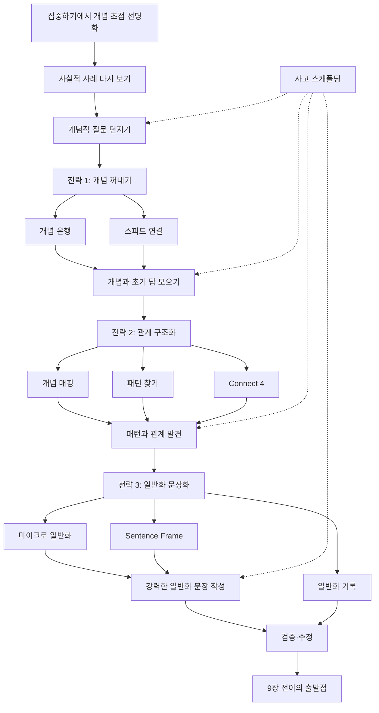

# 📖 개념기반 탐구학습의 실천 — 8장. 일반화하기

> **저자**: 카를라 마샬(Carla Marschall), 레이첼 프렌치(Rachel French)
> **요약 날짜**: 2026-02-23
> **요약자**: 나

---

## 1. 한눈에 보기

1. 목적: 사실적 예와 개념을 연결하여 **전이 가능한 개념적 이해**를 명확하게 하는 단계
2. 사용하는 질문: 개념적 질문

일반화하기는 사실적 예와 개념을 연결하여 **전이 가능한 개념적 이해**를 명확하게 하는 단계이다. 교사는 한 단원에 대해 5~9개의 일반화를 개발해야 하며(1~2개는 개념적 렌즈 관련, 나머지는 단원 학습 내용), 학생들이 스스로 일반화 문장에 도달하도록 돕는 것이 핵심이다. 이를 위해 **개념적 질문**, **사고 스캐폴딩을 위한 질문/개념 은행/패턴 탐색** 등 다양한 전략을 사용한다. 강력한 일반화는 현재형 시제, 능동태, 2개 이상의 개념, 가치 판단에서 자유로운 서술 등의 요건을 갖추어야 한다. 교사는 '왜', '어떻게' 질문을 통해 학생의 사고를 스캐폴딩하고, 일반화 기록과 검증을 체계적으로 관리한다.

---

## 2. 핵심 개념 · 용어 정리

| 개념/용어 | 정의 · 설명 | 왜 중요한가 |
|-----------|-------------|-------------|
| 일반화(Generalization) | 개념 간의 관계를 진술한 문장. 사실적 지식을 넘어 전이 가능한 이해를 만들어줌 | 단원 학습의 도달점이자, 전이의 출발점 |
| 개념적 질문(Conceptual Question) | 사실적 질문과 달리, 특정 시간·장소·상황에 고정되지 않는 질문 | 학생을 일반화로 이끄는 핵심 도구 |
| 사실적 질문(Factual Question) | 특정 시간, 장소, 상황에 고정된 질문 | 사실적 토대를 마련하지만, 그 자체로는 전이 불가 |
| 강력한 일반화의 요소 | 현재형 시제, 능동태, 3인칭, 2개 이상의 개념, 필요에 따른 수식어, 가치 판단에서 자유로운 서술 | 이 요건을 갖춰야 시간·맥락을 넘어 전이 가능 |
| 사고 스캐폴딩 | 교사가 '왜', '어떻게' 질문을 통해 학생의 사고를 더 명확하게 만들어주는 것 | 일반화 과정 전체에서 지속적으로 필요 |
| 개념 은행(Concept Bank) | 핵심 개념어 카드를 제공하여 학생이 예/비예를 찾고, 개념을 합쳐 일반화하도록 돕는 도구 | *개념 자체에 대한 완전한 이해를 확인한 뒤 일반화로 넘어가는 다리 역할* |
| 스피드 연결(Speed Connection) | 개념적 질문에 대한 각자의 답을 가지고 그룹 짓기 → 더 큰 그룹 → 마이크로 개념 만들기 | *자기 답을 만든 뒤 동료와 합치며 개념을 정교화하는 협력적 전략* |
| 개념 매핑(Concept Mapping) | 15~20개 개념을 소그룹으로 묶고, 큰 개념을 위로 올리고, 선으로 연결하여 일반화 도출 | 개념 간 관계를 시각적으로 드러내는 전략 |
| 패턴 찾기(Finding Patterns) | 표로 개념을 검토하고 규칙을 명명하여 일반화 도출 | *비교와 분류를 통해 귀납적으로 일반화에 도달하는 전략* |
| 마이크로 일반화(Micro-generalization) | 전이가 제한된, 작은 범위의 일반화. 작은 집단/구체적 사례에서 시작하여 점차 확장 | *바로 큰 일반화를 쓰기 어려운 학생을 위한 발판. 작은 일반화를 쌓아 거시 일반화로 확장* |
| 일반화 기록 방법 | 학급책, 디지털 슬라이드, 교실 벽 타임라인, 단원 일반화 차트 등 | 일반화의 변화 과정을 가시화하고, 나중에 회고 가능 |

---

## 3. 핵심 논지 구조



이 장의 구조는 단순하다. 5장에서 선명해진 개념을 다시 사례 속에 넣고, 그 사이의 관계를 찾아 문장으로 고정하는 것이다. 차이는 "어떻게 관계를 잡아내느냐"에 있다. 어떤 활동은 개념을 꺼내는 데 강하고, 어떤 활동은 관계를 구조화하는 데 강하며, 어떤 활동은 그 관계를 일반화 문장으로 고정하고 기록하는 데 강하다.

전략군별로 보면 역할이 조금씩 다르다.
- **전략 1**은 학생 머릿속에 흩어진 개념과 초기 답을 밖으로 꺼내는 단계다.
- **전략 2**는 여러 사례를 묶고 연결하며 패턴을 찾는 단계다.
- **전략 3**은 관계를 일반화 문장으로 다듬고, 검증 가능하게 남기는 단계다.

### 전략별 정리

4장처럼 8장도 전략군별 공통 흐름으로 다시 보면 더 선명하다. 내가 이해한 8장의 흐름은 **꺼내기 → 연결하기 → 문장으로 고정하기**다. 다만 어떤 도구를 쓰느냐에 따라 학생이 일반화에 도달하는 발판이 달라진다.

#### 전략 1: 개념 꺼내기 전략

> **개념적 질문 제시 → 각자 답 만들기 → 개념 모으기 → 공통어 찾기**

- `개념 은행`: 핵심 개념 카드를 활용해 개념 이해를 확인하고, 일반화의 재료를 확보한다.
ex) `법과 인권`
 -> `인권`, `존엄`, `법`, `보장`, `침해`, `책임`, `차별` 카드를 모둠에 나눈다.
 -> 학생은 각 카드의 예와 비예를 들거나 관련 사례를 적는다.
 -> `이 개념은 무엇과 연결되는가?`를 묻자 `차별-침해`, `법-보장`, `책임-보호` 같은 연결 후보가 나온다.
 -> 아직 문장 완성은 아니지만 일반화의 재료가 손에 잡힌다.
- `스피드 연결`: 각자의 초기 답을 빠르게 비교하고 묶으며 마이크로 개념을 만든다.
ex) `서로 다른 권리가 충돌하면 어떻게 되는가?`
 -> 학생이 질문에 대한 자기 답을 짧게 적고 비슷한 답을 가진 친구를 찾는다.
 -> 작은 그룹이 다시 합쳐지며 `균형`, `합의`, `충돌`, `조정` 같은 공통어를 뽑는다.
 -> 각 그룹은 자기들의 공통어를 마이크로 개념으로 이름 붙인다.
 -> 이후 그 마이크로 개념들을 서로 연결하며 더 큰 일반화로 나아갈 준비를 한다.

#### 전략 2: 관계 구조화 전략

> **사례 비교 → 관계 드러내기 → 패턴 찾기 → 일반화 후보 만들기**

- `개념 매핑`: 개념 간 연결을 시각화하며 관계어를 붙인다.
ex) `법과 인권`
 -> 가운데 `인권`을 두고 `존엄`, `법`, `보장`, `침해`, `차별`, `구제`, `책임`을 배치한다.
 -> 학생은 선 위에 `보장한다`, `침해로 이어진다`, `회복을 돕는다` 같은 관계어를 적는다.
 -> 지도처럼 펼쳐진 연결망을 보며 `인권은 법을 통해 보장된다`, `차별은 인권 침해로 이어진다` 같은 일반화 후보가 떠오른다.
- `패턴 찾기`: 여러 사례를 표로 비교하며 반복되는 구조를 이름 붙인다.
ex) `인권 침해 사례 비교`
 -> `장애인 차별`, `학교 폭력`, `노키즈존` 사례를 `침해된 권리`, `원인`, `구제 방법`, `결과` 표로 정리한다.
 -> 반복되는 칸을 보며 `권리 충돌`, `편견`, `법 제정`, `사회적 논의` 같은 패턴을 발견한다.
 -> 여기서 `인권 침해의 반복은 새로운 법과 제도의 탄생을 촉진한다` 같은 일반화 후보가 나온다.
- `Connect 4`: 서로 다른 자료의 공통 패턴을 협력적으로 묶어낸다.
ex) `감정이 잘 전달되는 이야기`
 -> 4개 읽기 자료를 각 칸에 하나씩 정리한다.
 -> 학생은 각 자료가 어떤 표현 때문에 감정을 느끼게 했는지 기록한다.
 -> 네 칸을 함께 보며 `상세한 묘사`, `순서`, `관점` 같은 공통 요소를 찾는다.
 -> 최종적으로 `상세한 묘사는 독자가 화자의 감정을 느끼게 돕는다`는 일반화로 묶는다.

#### 전략 3: 일반화 문장화 전략

> **마이크로 일반화 만들기 → 문장 틀로 다듬기 → 강한 일반화로 확장하기 → 기록하고 점검하기**

- `마이크로 일반화`: 전이 범위가 작은 문장부터 만들며 큰 일반화의 발판을 놓는다.
ex) `노키즈존`
 -> 먼저 `노키즈존은 아동의 이동 자유를 제한한다`처럼 특정 사례 수준의 문장을 만든다.
 -> 이후 `한 집단의 권리 행사가 다른 집단의 권리를 제한할 때, 인권 침해가 나타난다`처럼 더 넓은 일반화로 확장한다.
 -> 학생은 작은 문장과 큰 문장의 차이를 비교하며 추상화 수준을 배운다.
- `Sentence Frame / 일반화 문장 틀`: 관계를 자기 언어의 일반화로 고정하게 한다.
ex) `판타지 문학`
 -> `판타지 이야기는 ______와 ______를 결합하여 독자가 이야기를 믿게 만든다` 틀을 제시한다.
 -> 학생은 `마법적 요소`, `현실적 요소`를 넣고 근거가 되는 장면을 덧붙인다.
 -> 틀은 단순한 빈칸 채우기가 아니라 개념 간 관계를 빠뜨리지 않도록 돕는 장치가 된다.
- `일반화 기록`: 학급 차트나 슬라이드에 일반화를 남기고, 이후 검증과 수정의 기준점으로 삼는다.
ex) `학급 일반화 차트`
 -> 모둠별 일반화를 칠판이나 디지털 슬라이드에 모은다.
 -> `현재형인가?`, `2개 이상 개념이 들어갔는가?`, `가치 판단이 없는가?`를 함께 점검한다.
 -> 수정된 문장을 단원 벽면에 남겨 9장의 Stress Test나 전이 활동 때 다시 꺼내 쓴다.

### PDF 참고: 학년별 일반화 스캐폴딩 수준 비교

| 요소 | 유아 (5~6세) | 1학년 | 5학년 |
|------|-------------|------|------|
| 일반화 표현 방식 | Sentence Frame 빈칸 채우기 / Concept Bank 단어 카드 | Sentence Frame + Exit Ticket 선택형 | 독립적 일반화 작성 → 소그룹 공유 → 학급 일반화 |
| 사례 유형 | 실물(식물, 동물), 역할극, 이미지 | 그림책 읽기, 극놀이, 그리기 | 소설, 영화 클립, 긴 텍스트 |
| 일반화 수 | 7개 | 5개 | 8개 |
| 전이 활동 | 밀웜 사육, 방학 돌봄 포스터 | 다른 관점으로 이야기 다시 쓰기 | 북클럽 Stress Test, 자신의 판타지 세계 창작 |

*(출처: 0218_studying 폴더 PDF — Science Early Years, Literacy Grade 1, Literacy Grade 5)*

### PDF 참고: 일반화 형성의 공통 구조

```
사실적 질문(F)으로 사례 탐구
        ↓
여러 사례에서 패턴 발견 (Organize)
        ↓
개념적 질문(C)으로 개념 간 관계 질문
        ↓
학생이 자신의 언어로 일반화 작성 (Generalize)
        ↓
새로운 사례에서 일반화 검증 (Transfer / Stress Test)
        ↓
일반화 수정 및 정교화 (Reflect)
```

### PDF 참고: 단원별 일반화 예시

**Science Early Years — Sharing the Planet (렌즈: Responsibility)**
- "Plants need water, light, air, nutrients and space to live and grow."
- "When people take living things out of their natural habitat, they become responsible for their needs."

**Literacy Grade 5 — Fantasy (렌즈: Story Elements)**
- "Fantasy stories blend magical and realistic details to make a story believable."
- "Readers examine external and internal quests to help determine themes in fantasy books."

**Literacy Grade 1 — Me and My Family (렌즈: Storytelling)**
- "Sharing personal stories with detailed descriptions helps the audience feel the emotions of the storyteller."
- "Authors properly sequence events to enable readers to make sense of a story."

---

## 4. 수업 적용 아이디어

### 💡 나의 아이디어

**개념적 질문 활용 팁**
1. 개념적 질문을 쓸 때 추상적으로 던지지 말고, **수업 상황과 연계**지어 질문을 던져야 한다.
   - 예: "상품과 서비스는 요구사항과 욕구를 어떻게 충족하는가?" → "상품과 서비스는 개인의 건강을 어떻게 도와주는가?"
2. 수업 의도에 개념적 질문에 대한 답을 할 수 있도록 배치하기
   - 예: "이 단원이 끝나면 ~ 질문에 대답을 하도록 하자!"
3. 그래픽 조직자에 개념적 질문을 위에 배치하기
4. 출구 티켓: 학생이 퇴실을 위해 개념적 질문에 대답해야 나갈 수 있음

**개념 매핑 적용 (법과 인권 단원)**
- 대개념: 인권
- 중위 개념: 침해 / 보장 / 보호
- 하위 개념: 차별, 소수자 / 헌법, 법, 존엄, 자유와 평등, 권리와 의무 / 사회구성원, 관심
- 10개 정도가 5학년 수준에 적당
- 순서: 전체 논의로 대개념 선정 → 수준 파악 후 중위 개념 탐색 → 하위 개념 배치 → 연결도 보고 관계 설명 → 일반화 문장 작성

### 🤖 Claude 제안

**1. 개념 은행 카드 활동 — '법과 인권' 단원**
- **적용 장면**: 사회 5학년, 법과 인권의 보장 단원 도입부
- **간단한 방법**: '인권', '법', '헌법', '존엄', '차별', '보장', '침해', '소수자', '의무', '구제' 10개 개념 카드를 모둠에 배분. 각자 맡은 개념의 예시/비예시를 찾고, "내 개념은 ~이다. ~때문에 ~개념과 연결된다" 형식으로 발표. 이후 2개 이상의 개념을 합쳐 일반화 문장 만들기.

**2. 노키즈존 토론 — 권리 충돌 체험**
- **적용 장면**: 사회 5학년, 인권 침해 사례 탐구 차시
- **간단한 방법**: "노키즈존은 인권 침해인가?"를 찬반 토론으로 진행. 사장님의 영업의 자유 vs 아이/가족의 이동의 자유·차별받지 않을 권리를 분석. 토론 후 "서로 다른 권리가 충돌할 때, 사회는 토론과 합의를 통해 균형점을 찾아간다"는 일반화에 도달하게 유도.

**3. 패턴 찾기 표 — 인권 침해 사례 비교**
- **적용 장면**: 사회 5학년, 인권 침해 사례 분석 차시
- **간단한 방법**: 3~4개의 인권 침해 사례(장애인 차별, 학교 폭력, 노키즈존, 혐오 표현)를 표로 정리. 각 사례의 '침해된 권리', '침해 원인', '구제 방법'을 비교. 공통 패턴을 발견하고, "한 집단의 권리 행사가 다른 집단의 권리를 제한할 때, 인권 침해가 나타난다" 일반화 도출.

---

## 5. 나의 생각 · 메모

### 읽으면서 든 생각

- 일반화 문장을 만드는 활동들(개념 은행, 스피드 연결, 개념 매핑, 패턴 찾기)의 공통점은 결국 **"개념 이해 → 관계 발견 → 문장화"**라는 동일한 사고 경로를 밟는다는 것
- 강력한 일반화를 위해 **능동태**와 **역동적 동사**(촉진한다, 결정한다, 확장시킨다 등)가 중요함을 깨달음
- 노키즈존 사례가 '권리 충돌'을 다루기에 5학년 수준에서 딱 적절할 것 같음

### // 질문에 대한 답변

**Q1. "사고의 스캐폴딩에서 '왜', '어떻게'를 계속 물어봐줘야 한다는 것인데, 구체적인 예시는?"**

일반화 과정의 매 단계에서 이렇게 쓸 수 있다:
- **사례 탐구 단계**: "왜 이 사례에서 인권 침해가 일어났을까?" (원인 탐색)
- **개념 연결 단계**: "이 사례와 저 사례는 어떻게 비슷한가?" (패턴 발견)
- **일반화 단계**: "왜 그렇게 말할 수 있는가? 다른 상황에서도 그러한가?" (검증)
- **전이 단계**: "이 일반화가 노키즈존 사례에서도 적용되는가? 어떻게?" (확장)

*PDF 예시: Literacy Grade 5 단원에서 "Why do fantasy stories include both magical and realistic details?"라는 개념적 질문을 Engage → Investigate → Generalize 각 단계마다 반복 사용하며, 학생의 답이 점차 정교화되는 과정을 보여줌.*

**Q2. "일반화의 증거를 학생이 어떻게 찾아내는지 예시"**

학생이 일반화를 세운 뒤, **Stress Test**(검증) 활동을 한다:
- "동물은 기본 필요를 충족하는 서식지에 산다"라는 일반화 → 새로운 동물 사례(북극곰, 사막여우)에 적용하여 여전히 참인지 확인
- "판타지 이야기는 마법적/현실적 세부사항을 혼합한다" → 북클럽에서 다른 판타지 책을 읽으며 증거 찾기
- 법과 인권 수업: "인권 침해의 반복이 새로운 법을 촉진한다" → 아동 노동법, 장애인차별금지법 등의 탄생 배경을 증거로 제시

**Q3. "개념적 질문이 단원 전체에서 매번 반복될 필요는 없겠지?"**

맞다. 개념적 질문은 **단원 수준**에서 설정하고, 매 차시가 아니라 **탐구(Inquiry) 묶음 단위**에서 답하도록 하는 것이 적절하다. PDF 단원들을 보면, 하나의 개념적 질문(C)이 2~3차시에 걸친 탐구를 관통하고, 그 탐구가 끝날 때 학생이 일반화로 답하는 구조이다.

**Q4. "단원 수업이 끝나면 대답을 하도록 하자가 더 맞는 것 같은데"**

절반은 맞다. 거시 일반화에 대한 개념적 질문은 **단원 끝에서 답하는 것**이 맞고, 미시 일반화에 대한 개념적 질문은 **각 탐구 묶음이 끝날 때** 답한다. 즉 질문의 크기에 따라 답하는 시점이 다르다.

**Q5. "그래픽 조직자에 표시하기 — 어떤 모양으로 한다는 거지?"**

개념적 질문을 그래픽 조직자의 **최상단에 배치**한다. 예:

```
┌─────────────────────────────────────────┐
│  C: 서로 다른 권리가 충돌하면 어떻게 되는가? │ ← 개념적 질문
├─────────────────────────────────────────┤
│  사례1: 노키즈존 │ 사례2: 학교 폭력  │ 사례3: ... │ ← 사실적 탐구
├─────────────────────────────────────────┤
│  패턴/공통점:                              │ ← 분석
├─────────────────────────────────────────┤
│  일반화:                                  │ ← 도달점
└─────────────────────────────────────────┘
```

*PDF 예시: Cross Comparison Chart가 이 구조를 따르며, 3개 단원 모두에서 공통 사용됨.*

**Q6. "스피드 연결 — 마이크로 개념만 만들고 끝인가?"**

아니다. 스피드 연결의 전체 흐름은:
1. 개념적 질문에 대한 **각자의 답**을 가지고 짝/소그룹을 찾음
2. 비슷한 답끼리 모여 **더 큰 그룹** 형성
3. 각 그룹이 자신들의 공통점을 **마이크로 개념으로 명명**
4. **그 다음**: 마이크로 개념들을 전체 공유 → 마이크로 개념 간의 관계를 찾아 **일반화 문장**을 만드는 것이 최종 목표

**Q7. "연결 4 — 각 그룹별로 탐구해서 어쩌란 말이지?"**

'연결 4(Connect 4)'는:
1. 4가지 그룹이 각자 **다른 사례**를 탐구
2. 각 그룹이 자기 사례에서 핵심 발견을 정리
3. 4그룹이 모여서 **공통 패턴**을 찾음
4. 공통 패턴을 바탕으로 **일반화 문장** 작성

*PDF 예시: Literacy Grade 1 단원에서 Connect 4 Placemat(p.218)을 사용 — 4개의 읽기 자료가 각각 감정을 느끼게 했는지를 4칸에 정리한 뒤, 공통점에서 "상세한 묘사가 감정 전달을 돕는다"는 일반화를 도출.*

**Q8. "개념 매핑 예시에는 어떤 게 있을까?"**

법과 인권 단원에서:
```
        [존엄] ← 근거 → [인권]
                          ↕
    [헌법] → [법] → [보장]   [침해] ← [차별]
                          ↕
              [구제] ← [책임] → [국가]
```
학생들이 선을 긋고 관계어를 적는 방식. 이후 "인권은 법을 통해 보장된다", "차별은 인권 침해로 이어진다" 같은 일반화가 나온다.

**Q9. "패턴 찾기 — 수학, 과학 외에서도 쓸 수 있나?"**

물론이다. 사회에서도 적극 활용 가능:

| 사례 | 침해된 권리 | 침해 원인 | 구제 방법 | 결과 |
|------|-----------|----------|----------|------|
| 장애인 차별 | 평등권 | 편견, 시설 미비 | 차별금지법 | 법 제정 |
| 학교 폭력 | 안전권 | 권력 불균형 | 학교폭력예방법 | 제도 정비 |
| 노키즈존 | 이동의 자유 | 영업 자유와 충돌 | 토론·합의 진행 중 | 사회적 논의 |

→ 패턴: "인권 침해의 반복은 새로운 법과 제도의 탄생을 촉진한다"

**Q10. "마이크로 일반화 — 뭔지 모르겠음"**

마이크로 일반화는 **전이 범위가 작은 일반화**로, 큰 일반화를 바로 쓰기 어려운 학생에게 **발판(stepping stone)**이 된다.

예시:
- 마이크로: "발톱이 날카로운 동물은 사냥에 유리하다" (특정 사례)
- → 더 넓은 일반화: "동물의 신체 구조는 생존 방식에 영향을 준다" (전이 가능)

법과 인권에서:
- 마이크로: "노키즈존은 아동의 이동 자유를 제한한다" (특정 사례)
- → 더 넓은 일반화: "한 집단의 권리 행사가 다른 집단의 권리를 제한할 때, 인권 침해가 나타난다" (전이 가능)

*PDF 예시: Science Early Years 단원에서 "People can _____ other living things"라는 마이크로 일반화를 여러 사례에서 반복한 뒤, 최종적으로 "When people take living things out of their natural habitat, they become responsible for their needs"라는 거시 일반화에 도달.*

---

## 6. 연결 고리

- **9장(전이하기)**: 8장에서 만든 일반화를 새로운 맥락에서 **검증하고 확장**하는 단계. 8장이 "일반화 만들기"라면 9장은 "일반화 시험하기"이다. Stress Test, "만약에 ~라면", "증명해봐!" 등의 전략으로 이어진다.
- **PDF 단원들과의 연결**: 3개 PDF 단원 모두 Engage → Focus → Investigate → Organize → **Generalize** → Transfer → Reflect의 동일한 탐구 단계를 따르며, 8장의 전략들(개념 은행, 패턴 찾기, Sentence Frame 등)이 Generalize 단계에서 핵심적으로 사용됨.
- **IB PYP와의 연결**: PYP의 Key Concepts(Form, Function, Causation, Change, Connection, Perspective, Responsibility)가 개념적 렌즈 역할을 하며, Related Concepts가 단원 내용에 맞는 구체적 렌즈 역할을 한다. 8장의 '개념적 렌즈'와 PYP의 Key Concepts는 유사한 기능이지만, PYP는 7개 고정 + Related Concepts 층위 구분, Erickson은 단원별 자유 선택이라는 차이가 있다.
