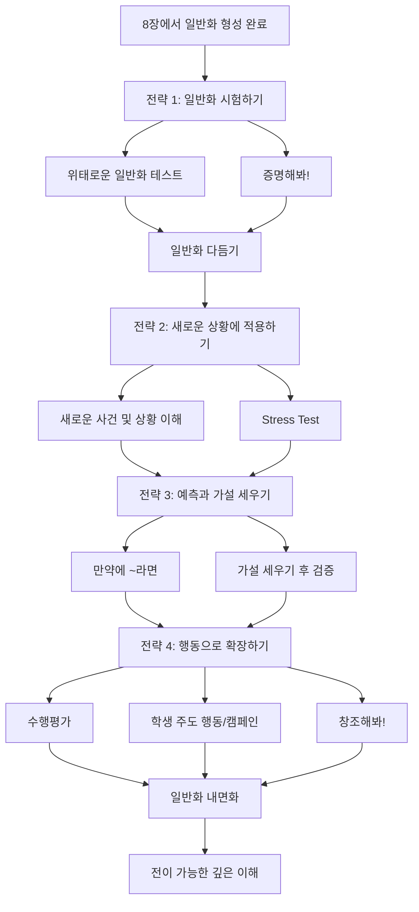

# 📖 개념기반 탐구학습의 실천 — 9장. 전이하기

> **저자**: 카를라 마샬(Carla Marschall), 레이첼 프렌치(Rachel French)
> **요약 날짜**: 2026-02-22
> **요약자**: 나

---

## 1. 한눈에 보기

1. 목적: 일반화를 **검증하고, 날카롭게 다듬고, 새로운 맥락에 확장 적용**하는 과정
2. 사용하는 질문: 사실적 질문, 개념적 질문, 호기심 촉발 질문

전이하기는 탐구의 마지막 단계로, 학생들이 형성한 일반화를 **검증하고, 날카롭게 다듬고, 새로운 맥락에 확장 적용**하는 과정이다. 핵심 전략은 네 가지로 나뉜다: (1) 일반화 테스트 및 벼리기, (2) 새로운 사건·상황에의 적용, (3) 예측 및 가설 형성, (4) 실제 행동(수행평가·캠페인 등)으로의 확장. 이 단계에서 교사는 사실적·개념적·호기심 질문을 활용하여 학생의 사고를 자극하고, 학생이 일반화를 단순히 암기하는 것이 아니라 **자신의 것으로 내면화**하도록 돕는다. 궁극적으로 전이하기는 "배운 내용이 다른 상황에서도 통하는가?"를 스스로 확인하게 함으로써 깊은 이해에 도달하게 하는 장치이다.

---

## 2. 핵심 개념 · 용어 정리

| 개념/용어 | 정의 · 설명 | 왜 중요한가 |
|-----------|-------------|-------------|
| 전이(Transfer) | 학습한 일반화를 새로운 맥락·상황에 적용하는 것 | 진정한 이해는 배운 맥락 밖에서도 작동할 때 증명됨 |
| 일반화(Generalization) | 개념 간의 관계를 진술한 문장. *사실적 지식을 넘어 전이 가능한 이해를 만들어주는 핵심 도구* | 전이하기의 출발점이자 테스트 대상 |
| 위태로운 일반화 테스트 | 잘된 일반화와 약한 일반화 4-6개를 섞어 제시하고 학생이 판단하게 하는 전략 | 일반화를 수동적으로 받아들이는 것이 아니라 비판적으로 검토하게 함 |
| 증명해봐!(Prove it!) | 명제를 주고 배운 내용으로 증명하게 하는 전략 | 수학·과학 등에서 논리적 사고와 개념 적용력을 키움 |
| 만약에 ~라면(What if) | 가정적 질문을 통해 일반화를 활용한 예측·가설을 형성하는 전략 | 학생이 배운 내용을 능동적으로 활용하여 추론하게 함 |
| 사실적 질문 | 특정 사실이나 정보를 묻는 질문 | 전이 과정에서 근거를 확인하는 데 사용 |
| 개념적 질문 | 개념 간 관계를 묻는 질문 | 일반화를 이끌어내고 검증하는 핵심 질문 유형 |
| 호기심 질문 | *학생의 궁금증에서 출발하는 열린 질문. 탐구를 확장하는 역할* | 학생 주도적 전이를 촉진 |

---

## 3. 핵심 논지 구조

9장의 핵심은 일반화를 그냥 외운 상태에서 끝내지 않고, 시험하고, 적용하고, 예측하고, 실제 행동으로 옮기면서 자기 것으로 만드는 데 있다. 즉 8장에서 만든 일반화가 9장에서 비로소 살아 움직이기 시작하며, 그 과정의 도달점이 바로 전이 가능한 깊은 이해다.

전략군별로 보면 역할이 조금씩 다르다.
- **전략 1**은 학생이 기존 일반화를 비판적으로 시험해 보는 단계다.
- **전략 2**는 새로운 사례에 적용하며 일반화의 범위를 넓히는 단계다.
- **전략 3**은 아직 일어나지 않은 상황까지 예측하게 하여 먼 전이를 촉진하는 단계다.
- **전략 4**는 수행과 행동으로 일반화를 실제 삶의 판단 기준으로 바꾸는 단계다.

### 전략별 정리

4장처럼 9장도 전략군별 공통 흐름으로 다시 보면 더 선명하다. 내가 이해한 9장의 흐름은 **시험하기 → 적용하기 → 예측하기 → 행동하기**다. 일반화는 이 네 단계를 거치며 비로소 학생의 말이 아니라 학생의 판단 기준이 된다.

#### 전략 1: 일반화 시험하기 전략

> **기존 일반화 소환 → 대조·판단 → 반례 찾기 → 일반화 다듬기**

- `위태로운 일반화 테스트`: 잘된 일반화와 약한 일반화를 섞어 놓고 학생이 스스로 판별하게 한다.
ex) `지형과 생활`
 -> `지형은 사람들의 생활 모습에 영향을 준다`, `평야가 넓은 지역일수록 인구가 많다`, `산이 많은 나라는 발전하기 어렵다` 같은 카드를 모둠에 준다.
 -> 학생은 동의/비동의로 분류하면서 왜 약한 일반화인지 근거를 말한다.
 -> `서울`, `스위스` 같은 반례를 들며 문장을 수정한다.
 -> 이 과정에서 기존 일반화가 앵커 역할을 하며 학생의 판단 기준이 선명해진다.
- `증명해봐!(Prove it!)`: 사실적 진술 혹은 개념적 진술(배운 내용)을 주고 증명하게 하여 일반화의 근거를 점검한다.
ex) `동물의 신체 구조는 생존 방식에 영향을 준다`
 -> 학생에게 `북극곰의 발`, `사막여우의 귀`, `오리의 발` 자료를 제시한다.
 -> 각 구조가 어떤 생존 방식과 연결되는지 증거를 찾아 설명하게 한다.
 -> 단순히 맞다고 답하는 것이 아니라 `왜 그렇게 말할 수 있는가`를 증명해야 한다.

#### 전략 2: 새로운 상황에 적용하기 전략

> **새 사례 제시 → 기존 일반화 연결 → 어디까지 적용되는지 보기 → 범위 조정하기**

- `새로운 사건 및 상황 이해`: 같은 일반화를 다른 사례에 적용하며 전이 범위를 확인한다.
ex) `과학자의 관찰`
 -> 식물 실험에서 만든 `과학자는 관찰을 통해 정보를 수집한다` 일반화를 다시 꺼낸다.
 -> 이번에는 동물 관찰 자료를 보여주며 `우리가 배운 관찰 방법을 여기에도 쓸 수 있을까?`를 묻는다.
 -> 학생은 관찰 항목을 바꾸거나 유지하며 일반화가 새 맥락에서도 작동하는지 확인한다.
- `Stress Test(일반화 테스트 강조)`: 새 텍스트나 새 자료에 일반화를 적용해 지지 여부를 확인한다.
ex) `판타지 문학`
 -> 학급이 함께 만든 `판타지는 마법적 요소와 현실적 요소를 섞어 이야기를 믿을 만하게 만든다`를 북클럽 책에 적용한다.
 -> 학생은 새 책에서 마법적 요소와 현실적 요소를 각각 찾는다.
 -> 일반화가 그대로 지지되는지, 수정이 필요한지 토론한다.
- 어떻게 연결되는가: 일반화와 관련된 새로운 사례 소개. 새로운 사례와 기존 사례 연결하기
ex) `민주주의에서의 견제와 균형`
 -> 새로운 예시들을 견제/균형 각각에 분류한다.
 -> 왜 그런지 설명한다.
#### 전략 3: 예측 및 가설 세우기 전략

> **가정적 상황 제시 → 일반화 불러오기 → 결과 예측 → 근거 점검하기**

- `만약에 ~라면(What if)`: 아직 일어나지 않은 상황에 일반화를 적용하여 예측하게 한다.
ex) `우리 동네가 섬이 된다면`
 -> `지형은 사람들의 생활 모습에 영향을 준다` 일반화를 다시 제시한다.
 -> `만약 우리 동네가 사방이 바다로 둘러싸인 섬이 된다면 생활은 어떻게 달라질까?`를 묻는다.
 -> 학생은 교통, 음식, 직업, 여가, 경제 가운데 3가지 이상을 골라 변화와 이유를 쓴다.
 -> 핵심 평가는 정답이 아니라 `~이기 때문에 ~할 것이다` 식의 정당화다.
- `가설 세우기 후 검증`: 예측을 실험이나 추가 탐구로 이어 가게 한다.
ex) `식물 실험`
 -> `이 식물에 물을 주지 않으면 어떻게 될까?`를 묻는다.
 -> 학생은 `식물은 물, 빛, 공기, 양분, 공간이 필요하다` 일반화를 근거로 가설을 세운다.
 -> 이후 관찰 기록을 통해 자기 가설이 얼마나 타당했는지 검토한다.

#### 전략 4: 행동으로 확장하기 전략

> **일반화 선택 → 실제 과제 설계 → 산출물 만들기 → 성찰하며 내면화하기**

- `수행평가`: 일반화를 실제 과제 수행의 기준으로 사용하게 한다.
ex) `교실 생물 돌보기 포스터`
 -> `사람이 생물을 자연 서식지에서 데려오면 그 필요를 책임져야 한다` 일반화를 바탕으로 포스터나 영상을 만든다.
 -> 학생은 먹이, 물, 공간, 돌봄 방법을 실제 상황에 맞게 제안한다.
 -> 일반화가 행동 지침으로 바뀌는지 확인할 수 있다.
- `학생 주도 행동/캠페인`: 일반화를 공동체 행동으로 확장한다.
ex) `존중과 배려 캠페인`
 -> `다양성을 존중할 때 공동체가 더 강해진다` 일반화를 바탕으로 학교 캠페인을 기획한다.
 -> 포스터, 아침 방송, 실천 서약서 같은 산출물을 만든다.
 -> 활동 뒤 `일반화가 학교 안에서 실제로 어떻게 작동했는가`를 성찰한다.
- `창조해봐!`: 새 작품이나 새 산출물을 만들며 일반화를 창조적으로 전이한다.
ex) `나만의 판타지 세계 만들기`
 -> `판타지는 마법적 요소와 현실적 요소를 섞어 이야기를 믿을 만하게 만든다` 일반화를 기준으로 세계관을 설계한다.
 -> 학생은 어떤 현실적 요소와 어떤 마법적 요소를 결합했는지 설명문을 함께 쓴다.
 -> 창작물이 일반화의 이해 수준을 드러내는 평가 자료가 된다.

---

## 4. 수업 적용 아이디어

### 💡 나의 아이디어

(아직 작성하지 않음 — 나중에 추가하세요)

### 🤖 Claude 제안

**아이디어 1: "위태로운 일반화 카드 게임" (일반화 테스트)**
- **적용 장면**: 사회 — 3~4학년 '우리 지역의 환경과 생활' 단원 마무리
- **간단한 방법**: "환경은 사람들의 생활 모습에 영향을 준다", "모든 지역의 생활 모습은 동일하다" 등 6개 일반화 카드를 모둠에 배부한다. 모둠별로 동의/비동의 판에 카드를 분류하고, "저희는 ~한 이유로 ~에 동의합니다" 문장 틀로 근거를 발표한다. 토론 후 수정 기회를 준다.

**아이디어 2: "만약에 ~라면 토론" (예측 및 가설)**
- **적용 장면**: 과학 — 5학년 '생태계와 환경' 단원
- **간단한 방법**: "만약 우리 학교 뒷산의 나무가 모두 사라진다면?" 같은 가정적 질문을 던진다. 학생들은 생태계 일반화(생산자-소비자-분해자의 관계)를 근거로 "~ 때문에 나는 ~라고 생각한다" 형식으로 예측을 적고, 짝과 공유 후 반 전체 토론한다.

**아이디어 3: "우리 반 캠페인 프로젝트" (적용 및 행동)**
- **적용 장면**: 도덕/창체 — 6학년 '존중과 배려' 또는 환경 관련 주제
- **간단한 방법**: 단원에서 형성한 일반화(예: "다양성을 존중할 때 공동체가 더 강해진다")를 바탕으로, 학생들이 직접 학교 안 캠페인을 기획한다. 포스터, 아침 방송 원고, 실천 서약서 등 산출물을 만들고, 캠페인 후 일반화가 실제로 작동했는지 성찰 글을 쓴다.

---

### 📂 참고 자료 속 전이 사례

아래는 함께 제공된 4개 PDF에서 찾은 전이(Transfer) 단계 활동 사례들이다.

#### 사례 1: 과학 유아(Early Years) — "생물과 서식지" 단원
> **출처**: *Sharing the Planet: Living Things, Big and Small* (Keenan & Humble-Crofts)

| 전이 전략 | 활동 내용 |
|-----------|----------|
| **적용 및 행동 (수행평가)** | 방학이 다가올 때, "교실/집의 생물을 돌보는 방법"을 포스터로 그리거나 영상으로 촬영하여 설명한다. 일반화(U3: 부모는 새끼의 생존을 도울 수 있다, U5: 사람이 생물을 자연 서식지에서 데려오면 그 필요를 책임져야 한다)를 새로운 상황에 적용하는 과제. |
| **적용 및 행동 (학생 주도)** | 밀웜(Mealworm)을 몇 주간 직접 돌보며, 서식지에 필요한 것(먹이, 물)을 제공한다. 일반화 "동물은 기본적 필요를 충족하는 서식지에서 산다(U4)"를 실제 행동으로 전이. |
| **일반화 테스트 (Spectrum Sort)** | "모든 생물이 사람의 돌봄 없이는 생존할 수 없을까?" — 가축, 애완동물, 야생동물 이미지를 '돌봄 필요 ↔ 스스로 생존' 스펙트럼 위에 배치하고 정당화한다. *평가 시 카드의 위치보다 정당화(justification)가 더 중요하다고 명시.* |

#### 사례 2: 국어(ELA) 5학년 — "판타지 문학" 단원
> **출처**: *The Art of Fantasy: How To Create a World of Make Believe* (Flock)

| 전이 전략 | 활동 내용 |
|-----------|----------|
| **일반화 테스트 (Stress Test)** | 학급 공동으로 형성한 일반화 "판타지는 마법적 요소와 현실적 요소를 섞어 이야기를 믿을 만하게 만든다(U1)"를 **북클럽 도서**에 적용하여 검증한다. 같은 안내 질문(마법적 요소는? 현실적 요소는?)으로 새 텍스트를 분석하고, 일반화가 지지되는지 확인. |
| **적용 및 행동 (수행평가)** | 자신만의 판타지 세계를 스케치노트로 창작하고, "내가 목표 일반화를 어떻게 구현했는가"를 성찰 글로 쓴다. 루브릭은 일반화 이해(Understanding), 내용(Content), 과정(Process)을 기준으로 평가. |

#### 사례 3: 과학 유아 — "식물 실험" → 과학적 탐구 일반화 전이
> **출처**: *Sharing the Planet* 단원 내

| 전이 전략 | 활동 내용 |
|-----------|----------|
| **새로운 상황 이해** | "과학자는 관찰을 통해 정보를 수집한다(U6)"는 일반화를 식물 실험에서 형성한 뒤, 이를 **동물 관찰**에도 적용한다. "우리가 배운 관찰 방법을 동물에도 쓸 수 있을까?"로 전이를 유도. |
| **예측 및 가설 (What if)** | "이 식물에 ___를 주지 않으면 어떻게 될까?(Q1b)" — 학생이 일반화(식물은 물, 빛, 공기, 양분, 공간이 필요하다)를 바탕으로 가설을 세우고 실험으로 검증. |

#### 사례 4: 교육과정 이론적 근거
> **출처**: *Concept-Based Curriculum and Instruction for the Thinking Classroom 2e* (Erickson, Lanning, French)

- **"전이는 개념적 수준에서 일어난다"(Finding #5)**: 사실과 기능에 의해 뒷받침되는 일반화와 원리가 학생으로 하여금 패턴을 인식하고, 이전에 배운 개념적 이해의 새로운 사례 사이에서 연결을 만들 수 있게 해준다.
- *이는 9장의 모든 전이 전략이 "일반화"를 매개로 작동하는 이유를 이론적으로 뒷받침한다.*

---

## 5. 나의 생각 · 메모

### // 의문에 대한 답변

**Q1. "얼마나 유사/상이한 맥락에 전이시키는가?" — 이건 어떤 활동과 연계될까?**

이 평가 기준은 주로 **전략 2) "새로운 사건 및 상황 이해"**와 가장 직접적으로 연결된다. 학생이 완전히 새로운 사례(다른 교과, 다른 시대, 다른 지역 등)에 일반화를 적용할 수 있는지를 보기 때문이다. 다만 **전략 3) "예측 및 가설"**도 해당된다 — 가정적 상황은 아직 경험하지 않은 맥락이므로, 먼 전이(far transfer)에 가깝다.

정리하면:
- **유사한 맥락 전이** → 전략 1(같은 주제 내에서 일반화 검증) & 전략 2(비슷한 새 사례)
- **상이한 맥락 전이** → 전략 2(전혀 다른 사례) & 전략 3(가정적 상황) & 전략 4(실생활 행동)

**Q2. "얼마나 잘 정당화하냐" / "얼마나 일반화를 잘 적용해서 활동하는가"**

맞다. 이 두 기준은 네 가지 전략 **전반에 걸쳐** 작동한다. 어떤 전략을 쓰든 학생은 자기 생각을 정당화해야 하고, 일반화를 근거로 활용해야 한다. 이것이 전이하기 단계의 본질이다.

**Q3. 실제적인 평가 예시가 있었으면 함 (4번 평가 방법 관련)**

위의 참고 자료에서 구체적 평가 사례를 정리하면:

| 평가 유형 | 구체적 예시 | 평가 도구 | 출처 |
|-----------|------------|----------|------|
| **수행평가 (산출물)** | 교실 생물 돌보기 포스터/영상 제작 | 루브릭 | Science Early Years |
| **수행평가 (창작)** | 자신만의 판타지 세계 스케치노트 + 성찰 글 | 공동 제작 채점 기준표(Co-Created Scoring Guide) | Literacy Grade 5 |
| **형성평가 (관찰)** | 스펙트럼 정렬 활동에서 정당화 관찰 | 일화 기록(Anecdotal Notes) | Science Early Years |
| **형성평가 (대화)** | 일반화 명확화를 위한 개별/소그룹 컨퍼런스 | 체크리스트 | 공통 |
| **총괄평가 (문장 완성)** | 일반화 문장 틀 완성: "___는 ___하기 위해 ___한다" | *학생 반응이 개념 간 관계를 보여주는지 확인* | Science Early Years |

핵심: 전이 단계의 평가에서 가장 중요한 것은 **정답 여부가 아니라 정당화의 질**이다. Science Early Years 단원에서도 스펙트럼 정렬 활동의 평가 시 "카드의 위치보다 정당화가 더 중요하다(The justification is more important here than the placement of the cards)"라고 명시하고 있다.

> ✏️ _추가로 생각해볼 것:_
>
> - 나의 수업에서 전이하기 단계를 충분히 확보하고 있는가?
> - 일반화 테스트를 할 때, "위태로운 일반화"를 어떻게 설계할 수 있을까?
> - 학생 주도 행동(캠페인)까지 가려면 시간이 부족한데, 현실적으로 어떻게 운영할까?

---

## 6. 연결 고리

- **이전 장(8장 "일반화하기")과의 연결**: 8장에서 학생이 형성한 일반화가 9장의 출발점이 된다. 일반화가 부실하면 전이도 얕아질 수밖에 없으므로, 8장의 일반화 형성 과정이 탄탄해야 9장이 제대로 작동한다.
- **Erickson의 이론적 기반**: "전이는 개념적 수준에서 일어난다"는 원리가 9장의 모든 전략을 관통한다. 사실만 암기한 학생은 전이에 실패하고, 개념 간 관계(일반화)를 이해한 학생만이 새로운 맥락에 적용할 수 있다.
- **참고 단원들과의 연결**: Science Early Years, Literacy Grade 5 단원 모두 탐구의 마지막 단계에서 전이 활동을 배치하고 있으며, 이는 9장의 이론이 실제 단원 설계에 그대로 반영됨을 보여준다.
