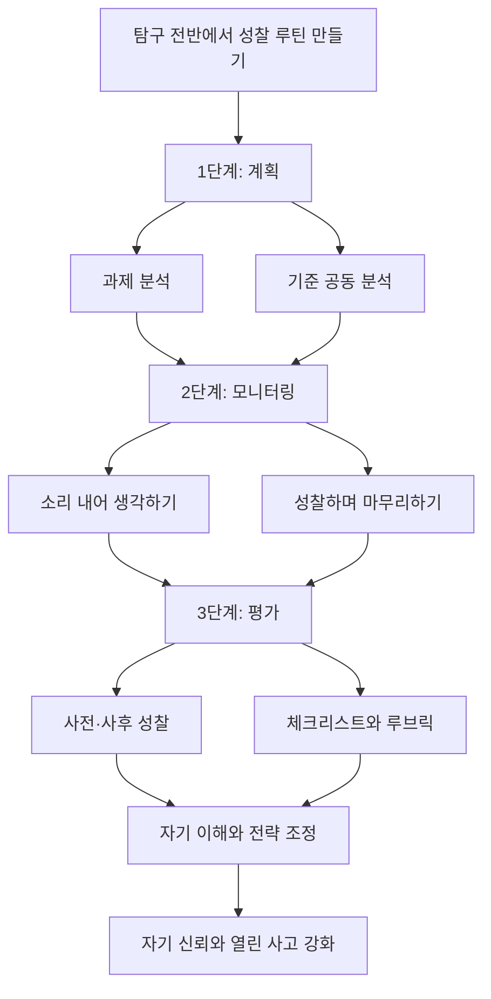

# 📖 개념기반 탐구학습의 실천 — 10장. 성찰하기

> **저자**: H. Lynn Erickson, Lois A. Lanning, Rachel French
> **요약 날짜**: 2026-03-07
> **요약자**: 나

---

## 1. 한눈에 보기

1. 목적: 학습자가 자신의 이해와 전략을 스스로 점검하고 다음 학습을 조정하게 하기
2. 핵심 사이클: 계획 → 모니터링 → 평가

성찰하기는 탐구가 끝난 뒤 느낌을 적는 부록이 아니라, **학습자가 자기 이해를 스스로 형성하고 조정하는 메타인지 단계**다. 책은 학습 평가에 적극적으로 참여하는 학생이 한 단원에서 의도한 개념을 더 깊이 이해하는 경향을 보인다고 설명하며, 이러한 자기점검이 곧 이해의 격차를 감지해 내는 힘과 연결된다고 본다. 즉 성찰은 `얼마나 배웠는가`를 확인하는 활동이면서 동시에 `나는 어떻게 배우는 사람인가`를 만들어 가는 과정이다.

핵심 구조는 `계획 → 모니터링 → 평가`의 순환이다. 먼저 과제를 어떻게 접근할지 계획하고, 수행 중에는 자기 생각과 전략을 점검하며, 마친 뒤에는 무엇이 효과적이었고 무엇을 바꿔야 하는지 평가한다. 이런 일련의 과정을 거치며 학생은 자신을 `자기 이해를 스스로 형성할 수 있는 학습자`로 바라보게 되고, 그 자기 신뢰는 학습에서 위험을 감수하고 열린 사고를 유지하는 태도와 연결된다. Landis와 Zimmerman의 말처럼, 학습은 성공에 필요한 지식을 기르는 일일 뿐 아니라 `성공할 수 있다는 믿음`도 함께 키워야 한다.

책에서 중요한 점은 성찰을 단원 끝 한 번으로 제한하지 않는다는 것이다. 성찰은 탐구 전반에 걸쳐 루틴처럼 반복되어야 하며, 메타인지 능력이 약한 학생일수록 더 자주, 더 쉽게, 더 짧게 연습할 기회를 주어야 한다. 그래서 성찰하기 자체의 방법과 이유도 하나의 `개념적 이해`로 가르칠 필요가 있다.

---

## 2. 핵심 개념 · 용어 정리

| 개념/용어 | 정의 · 설명 | 왜 중요한가 |
|-----------|-------------|-------------|
| 성찰하기 | 자신의 이해, 전략, 수행 과정을 돌아보며 다음 학습을 조정하는 활동 | 학습을 경험으로 끝내지 않고 자기조절로 이어지게 한다 |
| 메타인지 | 자신의 사고와 학습 과정을 한 걸음 떨어져 살피는 능력 | 이해의 격차를 감지하고 전략을 바꾸게 하는 핵심 능력 |
| 자기평가 | 기준을 바탕으로 자신의 이해나 수행을 스스로 판단하는 것 | 학습의 소유권을 학생에게 돌려준다 |
| 계획 | 과제를 시작하기 전에 목표, 방법, 어려움, 필요한 자원을 예상하는 단계 | 무작정 시작하지 않고 의도적으로 학습하게 한다 |
| 모니터링 | 학습 도중 이해 상태와 전략의 효과를 점검하는 단계 | 막히는 지점을 빨리 알아차리고 수정하게 한다 |
| 평가 | 학습 후 결과와 과정을 돌아보며 무엇이 효과적이었는지 판단하는 단계 | 다음 학습에 전이 가능한 교훈을 남긴다 |
| 자기 신뢰 | 자신이 학습을 조절하고 이해를 확장할 수 있다는 믿음 | 위험 감수와 열린 사고를 가능하게 한다 |
| 대화 유도 전략 | 성찰을 돕는 문장 틀이나 말걸기 장치 | 어린 학생도 자신의 사고를 언어화하기 쉽게 만든다 |
| 질문 은행 | 학생이 스스로 선택해 사용할 수 있도록 모아 둔 성찰 질문들 | 성찰을 교사 주도 문답이 아니라 학생 주도 점검으로 바꾼다 |
| 학습 일지/블로그 | 계획, 진행, 성찰을 누적 기록하는 도구 | 사고 변화와 전략의 흔적을 시간 흐름 속에서 보게 한다 |
| 과제 분석 | 과제를 작은 요소로 나누고 어려움과 요구를 미리 파악하는 활동 | 계획 단계의 질을 높여 준다 |
| 기준 공동 분석 | 성공적인 과제 수행의 기준을 교사와 학생이 함께 해석하는 활동 | 자기평가가 막연한 감상이 아니라 기준 기반 판단이 되게 한다 |
| 소리 내어 생각하기 | 학습 중 자신의 사고 과정을 말로 드러내는 전략 | 모니터링 과정을 보이게 만들어 피드백과 수정이 쉬워진다 |
| 사전·사후 성찰 | 배우기 전과 후에 같은 문장이나 기준으로 이해를 비교하는 성찰 | 변화의 방향과 깊이를 구체적으로 드러낸다 |
| 체크리스트/루브릭 | 기준을 항목화한 자기점검 도구 | 성찰의 정확도와 일관성을 높인다 |

---

## 3. 핵심 논지 구조

10장의 핵심은 성찰을 `마지막 소감 쓰기`가 아니라 **학습을 움직이는 순환 구조**로 보는 데 있다. 학생은 먼저 계획하고, 진행 중에는 스스로를 모니터링하고, 마친 뒤에는 평가한다. 이 세 단계가 한 번으로 끝나는 것이 아니라 탐구 전반에 걸쳐 반복될 때 메타인지가 실제 능력으로 자란다.

전략군도 이 구조에 맞춰 정리할 수 있다.
- **광범위한 전략**은 모든 단계에 걸쳐 성찰 루틴을 만들기 위한 장치다.
- **계획 전략**은 시작 전에 과제와 기준을 해석하게 한다.
- **모니터링 전략**은 진행 중 자신의 사고를 보이게 한다.
- **평가 전략**은 학습 후 변화와 정확도를 점검하게 한다.

### 전략별 정리

내가 이해한 10장의 흐름은 **준비하며 보기 → 하면서 보기 → 끝나고 비교하기 → 다음 학습자로 다시 서기**다. 성찰의 목적은 단순 회고가 아니라 `학습자 정체성`을 형성하는 데 있다.

#### 전략 1: 광범위한 전략

> **탐구 전반에 성찰 장치 심기 → 자주 짧게 연습하기 → 성찰 이유와 방법도 가르치기**

- `대화 유도 전략`: 학생이 자기 생각을 쉽게 꺼내도록 문장 틀과 말걸기 표현을 제공한다.
ex) `나는 지금 ___라고 생각한다`, `내가 헷갈리는 점은 ___이다`, `다음에는 ___해 보겠다`
 -> 성찰을 잘 못하는 학생도 말문을 열 수 있다.
 -> 특히 토론 뒤 즉각적인 자기점검 문장으로 쓰기 좋다.
- `질문 은행`: 교실 벽이나 활동지에 성찰 질문을 모아 두고 학생이 스스로 고르게 한다.
ex) `내 생각이 바뀐 순간은 언제였나?`, `어떤 질문이 내 이해를 넓혔나?`, `지금도 헷갈리는 것은 무엇인가?`
 -> 교사가 매번 질문을 던지지 않아도 학생이 스스로 점검할 수 있다.
 -> 성찰을 교사 통제 활동이 아니라 학생 선택 활동으로 바꾸는 데 유용하다.
- `학습 일지/블로그`: 계획, 중간 점검, 마무리 평가를 누적 기록한다.
ex) `단원 성찰 노트`
 -> 첫 시간에는 목표와 예상 어려움을 쓰고, 중간에는 진행 상황을 쓰고, 마지막에는 변화와 다음 전략을 쓴다.
 -> 시간에 따른 사고 변화를 확인하기 쉽다.

#### 전략 2: 계획 전략

> **과제 해석하기 → 성공 기준 함께 보기 → 어려움 예상하기 → 시작 전 자기 위치 점검하기**

- `과제 분석`: 과제가 무엇을 요구하는지 자세히 분해한다.
ex) `피시본 다이어그램으로 과제 분해`
 -> 큰 과제를 작은 하위 과제로 나눈다.
 -> `무엇이 쉬운가`, `무엇이 어려운가`, `어떤 자료가 필요한가`를 적어 본다.
 -> 막연한 부담을 줄이고 시작 전략을 세우게 한다.
- `기준 공동 분석`: 과제의 성공 기준을 교사와 학생이 함께 해석한다.
ex) `좋은 설명 글의 기준 함께 읽기`
 -> 루브릭 문장을 그냥 보여 주는 것이 아니라, 실제 예시와 연결해 풀어 본다.
 -> `무엇을 해야 성공이라고 볼 수 있는가`를 학생 스스로 말해 보게 한다.
 -> 이후 자기평가의 정확도가 높아진다.

#### 전략 3: 모니터링 전략

> **진행 중 자기 사고 드러내기 → 이해 상태 점검하기 → 막히는 지점 표시하기 → 전략 수정하기**

- `소리 내어 생각하기`: 학생이 문제 해결이나 탐구 중 자기 생각 과정을 말로 드러낸다.
ex) `자료 읽으며 생각 말하기`
 -> `나는 지금 이 부분을 이렇게 해석하고 있다`, `여기서 헷갈린다`, `다음에는 이 근거를 확인하겠다`처럼 말하게 한다.
 -> 교사와 친구가 그 사고 과정을 보고 피드백을 줄 수 있다.
 -> 모니터링이 눈에 보이는 행동이 된다.
- `성찰하며 마무리하기`: 활동 끝에 짧은 점검을 넣어 현재 이해 수준을 확인한다.
ex) `오늘 활동 마침 카드`
 -> `오늘 내가 확실히 이해한 것`, `아직 불분명한 것`, `다음 시간에 확인할 것` 세 줄만 적게 한다.
 -> 부담이 적어 자주 반복하기 좋다.
 -> 성찰이 루틴으로 자리 잡는다.

#### 전략 4: 평가 전략

> **전후 비교하기 → 기준에 비추기 → 자기평가 정확도 높이기 → 다음 적용점 찾기**

- `사전·사후 성찰`: 배우기 전과 후에 같은 문장으로 돌아보게 한다.
ex) `개념 이해 전후 비교`
 -> 배우기 전: `나는 ~을 이해하고 있다 / 나는 ~을 잘 모르겠다`
 -> 배운 후: 같은 문장으로 다시 답한다.
 -> 이어서 `내 이해에서 가장 중요한 변화는 무엇인가?`를 쓰게 한다.
 -> 개념적 매핑 결과물 전후 비교에도 적용할 수 있다.
- `체크리스트와 루브릭`: 스스로를 기준에 비추어 평가하게 한다.
ex) `발표 자기점검표`
 -> `나는 개념 간 관계를 설명했는가`, `근거를 제시했는가`, `질문에 반응했는가`를 체크한다.
 -> 중요한 것은 점수 자체보다 `왜 그렇게 판단했는가`를 설명하게 하는 것이다.
 -> 자기평가의 정확도를 높이는 훈련이 된다.

---

## 4. 수업 적용 아이디어

### 💡 나의 아이디어

- 성찰은 단원 끝에만 넣지 말고, 매 차시 `계획-모니터링-평가` 중 하나가 드러나게 짧게라도 설계해야 한다.
- 메타인지가 약한 학생에게는 긴 글쓰기보다 `문장 틀`, `체크 표시`, `전후 비교`처럼 부담이 낮은 방식이 더 적합하다.
- 성찰하기 자체를 하나의 학습 내용으로 보고, `왜 성찰해야 하는가`도 학생과 함께 개념적으로 다뤄야 한다.

### 적용 예시

- **아이디어 1: 차시 시작 `과제 분석 3분 루틴`**
  - **적용 장면**: 모든 교과 탐구 활동 시작
  - **간단한 방법**: 활동 시작 전 `오늘 해야 할 일`, `어려울 것 같은 점`, `도움이 필요한 점` 세 칸만 빠르게 적게 한다. 짧지만 계획 전략이 루틴화된다.

- **아이디어 2: 활동 중 `소리 내어 생각하기` 짝 점검**
  - **적용 장면**: 국어 읽기, 사회 자료 해석, 과학 탐구 기록
  - **간단한 방법**: 짝과 번갈아 `지금 내가 이해한 것`, `헷갈리는 것`, `다음에 확인할 것`을 30초씩 말한다. 교사는 그 말을 듣고 오개념이나 막힘을 빠르게 발견할 수 있다.

- **아이디어 3: 단원 끝 `사전·사후 한 문장 비교`**
  - **적용 장면**: 개념 중심 단원 마무리
  - **간단한 방법**: 단원 시작에 쓴 `나는 ~을 이해하고 있다/모르겠다` 문장으로 다시 돌아오게 한다. 이후 `내 이해에서 가장 중요한 변화 한 가지`를 쓰게 하면 변화가 눈에 보인다.

---

## 5. 나의 생각 · 메모

### 읽으면서 정리된 점

- 성찰은 단순한 `느낀 점`이 아니라 메타인지 훈련이다.
- 학생이 자기 이해의 빈틈을 감지하는 힘은 곧 학습 전략을 바꾸는 힘과 연결된다.
- 성찰을 자주, 짧게, 반복적으로 넣지 않으면 메타인지는 일부 학생만 사용하는 기술로 남을 가능성이 크다.
- 결국 10장은 `자기평가`보다 더 넓은 장이다. 계획, 점검, 평가 전체를 묶는 자기조절 학습의 관점으로 읽는 편이 더 정확하다.

### 평가 포인트

- 학생이 메타인지 전략 사용을 말과 행동으로 실제 드러내는가?
- 학생이 자신의 이해를 얼마나 정확하게 평가하는가?
- 학생이 `효과적인 학습자`에 대해 만든 일반화를 다음 학습 상황으로 전이시키는가?
- 성찰 결과가 다음 계획 수정으로 실제 이어지는가?

### 스스로 점검할 질문

- 나는 성찰을 단원 끝 소감 쓰기 정도로만 취급하고 있지 않은가?
- 계획, 모니터링, 평가 중 내 수업에서 가장 비어 있는 단계는 무엇인가?
- 학생이 성찰을 `해야 하는 일`이 아니라 `자기 학습을 조절하는 도구`로 이해하도록 돕고 있는가?

---

## 6. 연결 고리

- **9장 전이하기와의 연결**: 9장에서 일반화를 새로운 맥락에 적용했다면, 10장에서는 그 적용이 실제로 어떤 이해와 전략 변화를 만들었는지 돌아본다. 전이가 적용이라면 성찰은 그 적용의 의미를 붙잡는 단계다.
- **8장 일반화하기와의 연결**: 학생이 성찰할 때 결국 다시 꺼내 보는 것은 `내가 어떤 일반화를 이해했는가`이다. 그래서 성찰은 일반화의 질을 다시 검토하는 마지막 점검이기도 하다.
- **전체 탐구 구조와의 연결**: 10장은 탐구 끝에만 붙는 장이 아니라, 관계맺기부터 전이하기까지 전 과정을 관통하는 메타인지 프레임으로 읽을 수 있다. 책의 마지막 장에 놓여 있지만 실제로는 모든 장을 가로지르는 운영 원리다.
