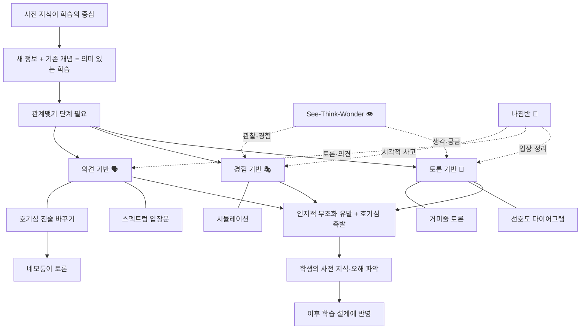

# 📖 개념기반 탐구학습의 실천 — 4. 관계맺기

> **저자**: 캐시 H. 마르쉬탈, 레이첼 프렌치
> **요약 날짜**: 2026-02-26
> **요약자**: 나

---

## 1. 한눈에 보기

4장은 개념기반 탐구학습의 첫 단계인 '관계맺기'를 다룬다.
핵심은 **학생의 사전 지식을 활성화하여 새로운 학습과 연결**짓는 것이다.
의미 있는 학습은 새로운 정보가 이미 가진 개념과 연결될 때 발생하며,
이를 위해 의견 기반·경험 기반·토론 기반의 세 가지 전략 유형을 제시한다.
관계맺기 단계의 목적은 단원과의 연결성 확보, 인지적 부조화 유발, 안전한 노출이다.

---

## 2. 핵심 개념 · 용어 정리

| 개념/용어 | 정의 · 설명 | 왜 중요한가 |
|-----------|-------------|-------------|
| 관계맺기 | 단원 시작 시 학생의 사전 지식·경험을 새로운 학습 내용과 연결하는 단계 | 의미 있는 학습의 출발점이 됨 |
| 인지적 부조화 | *기존에 알고 있던 것과 새로운 정보 사이의 불일치에서 오는 불편함. 학습 동기를 유발하는 핵심 기제* | 학생이 "뭔가 다르다"고 느껴야 탐구하려는 의지가 생김 |
| 안전한 노출 | *학생이 틀려도 괜찮은 분위기에서 자신의 사전 지식과 생각을 드러내는 것* | 사전 지식의 오해까지 파악해야 제대로 된 학습 설계가 가능 |
| 안내 질문 | 사실·개념·호기심을 촉발하는 질문 | 학생의 사고를 방향성 있게 유도 |
| 사전 지식 | 학생이 이미 갖고 있는 지식과 경험 | 새로운 정보를 선택·구성하는 데 중심 역할 |
| 네모퉁이 토론 | 진술문에 대해 동의 정도(4단계)에 따라 교실 네 모퉁이로 이동하는 활동 | 의견 기반 전략의 대표적 방법 |
| See-Think-Wonder | 보고(See) → 생각하고(Think) → 궁금한 것(Wonder)을 순서대로 정리하는 사고 루틴 | *하버드 프로젝트 제로의 Visible Thinking 루틴. 관찰에서 호기심으로 자연스럽게 이어짐* |
| 거미줄 토론 | *학생들이 서로의 발언을 이어가며 토론하는 방식. 교사 개입 없이 학생 주도로 진행* | 토론 기반 전략으로, 사전 지식을 개념적 범주로 구성 |

---

## 3. 핵심 논지 구조

사전 지식이 학습의 핵심 기반이므로, 관계맺기 단계에서 세 가지 전략을 통해
학생의 기존 이해를 끌어내고, 인지적 부조화를 일으켜 탐구 동기를 만든다.

**See-Think-Wonder**와 **나침반**은 특정 범주에 딱 떨어지기보다 **여러 전략을 관통하는 사고 루틴**이다:
- **See-Think-Wonder**: See(관찰) → 경험 기반, Think·Wonder(사고·궁금) → 토론 기반으로 자연스럽게 이어짐
- **나침반**: 시각적으로 사고를 정리(경험 기반)하면서, 입장을 드러내고(의견 기반), 서로 나누는(토론 기반) 과정을 하나의 틀 안에서 통합

---

## 4. 수업 적용 아이디어

### 💡 나의 아이디어
(아직 작성하지 않음 — 나중에 추가하세요)

### 🤖 Claude 제안

- **아이디어 1: "살아남는 건 강한 동물?" 네모퉁이 토론**
  - **적용 장면**: 과학 3~4학년 '동물의 생활' 단원 도입
  - **간단한 방법**: "현재 살아있는 동물들은 가장 강력한 동물이다"라는 진술문으로 네모퉁이 토론 실시. 토론 후 '적응'이라는 개념을 학습한 뒤 진술문을 수정해보게 한다.

- **아이디어 2: See-Think-Wonder로 사회 단원 열기**
  - **적용 장면**: 사회 3~4학년 '우리 지역의 어제와 오늘' 도입
  - **간단한 방법**: 옛날 지역 사진과 현재 사진을 나란히 보여주고 See-Think-Wonder 루틴을 적용. 학생들이 '변화'라는 개념에 자연스럽게 접근하게 한다.

- **아이디어 3: 스펙트럼 입장문으로 수학 도입**
  - **적용 장면**: 수학 5~6학년 '비와 비율' 단원 도입
  - **간단한 방법**: "키가 큰 사람이 항상 발이 크다"처럼 비례 관계에 대한 진술문을 제시하고, 1~6단계 스펙트럼에서 입장을 정하게 한다. 비율 학습 후 입장 변화를 비교한다.

---

## 5. 나의 생각 · 메모

> ✏️ _여기에 나중에 생각을 적어보세요._
>
> - 이 장을 읽고 가장 인상 깊었던 점은?
> - 기존에 알고 있던 것과 달랐던 점은?
> - 더 알고 싶은 것은?

---

## 6. 연결 고리

- **8장·9장과의 관계**: *8장(조직하기)과 9장(일반화하기)은 관계맺기 이후의 단계들. 관계맺기에서 사전 지식을 잘 끌어내야 이후 조직하기·일반화하기가 효과적으로 작동한다.*
- (이전 장 요약과 비교하며 채워보세요)
