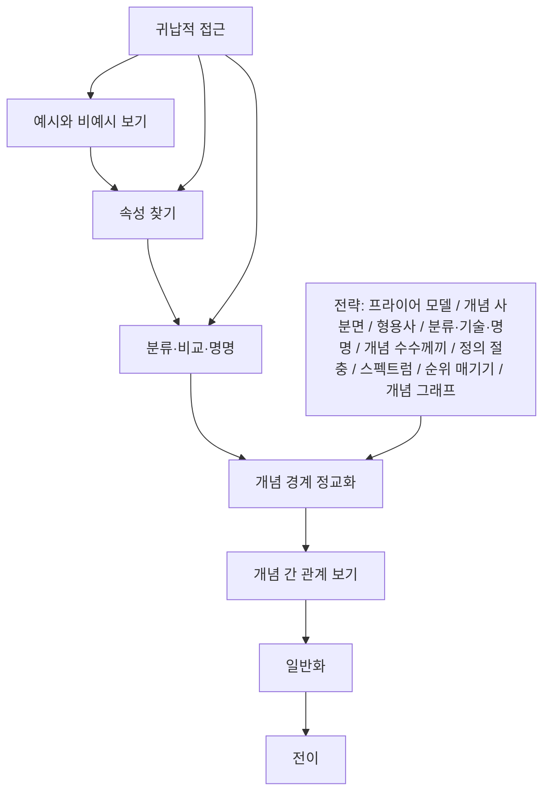

# 📖 개념기반 탐구학습의 실천 — 5장. 집중하기

> **저자**: 카를라 마샬(Carla Marschall), 레이첼 프렌치(Rachel French)
> **요약 날짜**: 2026-03-07
> **요약자**: 나

---

## 1. 한눈에 보기

5장 "집중하기"는 학생이 막연한 흥미에서 멈추지 않고, **개념의 속성과 경계를 또렷하게 붙잡도록 돕는 단계**로 이해했다. 핵심은 개념 형성을 개념적 사고의 출발점으로 보고, 예와 비예를 구분하고, 공통 속성을 말로 붙이고, 비교·분류·명명·순위 매기기 같은 전략으로 개념을 정교화하는 것이다. 내가 정리한 흐름은 **개념적 사고 → 일반화 → 전이**이며, Novak(2012)의 주장처럼 어떤 개념도 다른 개념과의 관계를 보지 않고는 깊이 이해할 수 없으므로 다양한 사람·맥락·사례 속에서 개념을 다루어야 한다. 또한 어린 학생에게는 귀납적 접근이 특히 적합할 수 있는데, *CBCI 2판 PDF에서 귀납적 수업을 예시 비교, 분류, 범주화, 패턴 찾기를 통해 학생이 자기 일반화를 구성하는 방식으로 설명하고, 유아·초등 저학년 예시도 놀이·분류·관찰 중심으로 제시한다는 점을 확인했다.*

---

## 2. 핵심 개념 · 용어 정리

| 개념/용어 | 정의 · 설명 | 왜 중요한가 |
|-----------|-------------|-------------|
| 개념 형성(Concept Formation) | 개념의 예가 되는 것과 예가 될 수 없는 것을 구분·분류·표시하며 개념 이해를 발전시키는 초기 단계 | 개념적 사고의 출발점이며, 이후 일반화와 전이의 토대가 됨 |
| 개념적 사고 | 개념의 속성, 예·비예, 관련 개념과의 차이·유사성을 파악하는 사고 | 일반화와 전이로 가기 전에 반드시 다져야 하는 기반 |
| 일반화 | 개념 간의 관계를 문장으로 진술한 것 | 집중하기 단계에서 정교화한 개념이 다음 단계에서 일반화로 발전함 |
| 전이 | 형성한 이해를 새로운 맥락에 적용하는 것 | 개념을 깊이 이해했는지 확인하는 최종 수준 |
| Novak(2012)의 관점 | 어떤 개념도 다른 개념과 어떻게 관련되는지 검토하지 않으면 진정으로 이해할 수 없으며, 다양한 사람과 맥락에서의 개념 탐구가 필요함 | 개념을 고립된 정의가 아니라 관계 속 이해로 보게 함 |
| 귀납적 접근 | 여러 예시를 통해 공통 속성과 패턴을 찾고, 그로부터 개념이나 결론을 이끌어내는 방식 | 어린 학생이 구체적 사례에서 출발해 개념을 잡는 데 특히 유용함 |
| 연역적 접근 | 목표 일반화나 개념을 먼저 제시하고, 이후 사실·사례가 이를 어떻게 뒷받침하는지 탐구하는 방식 | 이미 어느 정도 개념 틀이 잡힌 학생에게는 사고를 정리하는 데 유리함 |
| 프라이어 모델(Frayer Model) | 예시와 비예시를 나누고, 속성을 정리하며 개념의 경계를 분명히 하는 조직자 | 개념의 필수 속성과 비필수 속성을 구분하게 함 |
| 개념 사분면 | 4개의 사례 중 3개는 공통점이 있고 1개는 다른 것을 찾아, 무엇이 개념이 아닌 예인지 판별하고 속성을 정리하는 활동 | 예·비예 구분을 통해 개념 경계를 날카롭게 만듦 |
| 형용사 전략 | 여러 예시를 보고 적절한 형용사나 설명어를 고른 뒤, 그것을 바탕으로 개념을 정의하는 활동 | *예시의 공통 속성을 언어화하여 개념 정의로 나아가게 하는 다리 역할* |
| 분류/기술/명명 | 사례를 묶고, 그 묶음의 공통점을 말로 기술한 뒤, 이름을 붙이는 과정 | 학생이 단순 분류를 넘어 범주를 생성하고 개념어를 붙이게 함 |
| 개념 수수께끼 | "나는 ~의 일부다 / 필수 속성은 ~이다 / 다른 속성은 ~다 / 나는 누구냐?" 같은 형식으로 개념의 핵심 속성을 압축해 표현하는 활동 | 개념의 필수 속성을 골라내고 언어로 정리하도록 만듦 |
| 모두의 정의 절충 | 각자 또는 각 모둠의 정의를 비교하여 공통 요소를 추리고 공동 정의를 만드는 활동 | 개념을 더 넓고 정교하게 합의된 언어로 다듬게 함 |
| 스펙트럼 | 사례를 양 끝이 있는 연속선 위에 배치하며 정도 차이를 판단하는 활동 | 맞다/틀리다를 넘어 경계 사례와 강도 차이를 다루게 함 |
| 중요도 순위 매기기 | 개념의 속성, 기준, 사례를 중요도에 따라 배열하는 활동 | 필수 속성과 부가 속성을 구분하게 함 |
| 개념 그래프 | 핵심 개념과 관련 개념·속성·사례를 선으로 연결하며 관계를 시각화하는 활동 | 개념을 관계망 속에서 이해하게 하며 일반화로 이어지기 쉽다 |
| "~는 ~다. 왜냐하면" | 학생이 자신의 분류·판단·비교를 한 문장 주장과 근거로 정리하는 틀 | 개념 이해를 말과 글로 고정하고 평가 가능하게 만든다 |

---

## 3. 핵심 논지 구조

내가 이해한 5장의 중심 흐름은, 학생이 먼저 여러 예시와 비예시를 통해 속성을 파악하고, 이를 분류·비교·명명하면서 개념의 경계를 분명히 한 뒤, 나중에야 그 개념을 다른 개념과 연결해 일반화와 전이로 나아간다는 것이다. *이 흐름은 내가 이미 정리한 8장의 "개념 이해 → 관계 발견 → 문장화"와 정확히 이어진다.*

### 전략 2, 3에 대한 수업적 재구성

이번 대화에서 전략 2번과 3번을 수업 장면으로 다시 풀어보며, 두 묶음의 성격을 이렇게 이해하게 되었다.

#### 전략 2번의 공통 흐름

> **예시 보기 → 말 붙이기 → 묶기 → 이름 붙이기 → 정의 만들기**

- `형용사`: 예시를 설명하는 말에서 출발해 개념 속성을 언어화
ex) 책임
 -> 예시들을 보고 가장 잘 설명하는 형용사를 모둠마다 붙여본다.
 -> 모둠끼리 서로 비교한다.
 -> 좀 더 질문을 던져본다.
    -> 여러분이 공통적으로 뭘 넣었나요?
    -> 그냥 착한 것 vs 책임 있는 것 비교하기
    -> 결과를 책임지는 것도 '책임'을 지는 것일까?
-> 책임에 대한 정의를 내린다.
- `분류/기술/명명`: 묶고 설명하고 이름 붙이기
ex) 책임
-> 책임과 관련된 정도를 보이는 태도들 12장을 줌
-> 책임 있는 행동/애매한 행동/책임 없는 행동
-> 책임 있는 행동을 분류하고, 책임의 의미를 정의한다.
- `개념 수수께끼`: 핵심 속성을 압축해 표현하기
- `모두의 정의 절충`: 여러 정의를 비교해 학급 공동 정의 만들기

#### 전략 3번의 공통 흐름

> **정도 판단 → 중요도 판단 → 관계 구조화 → 근거와 함께 문장화**

- `스펙트럼`: 경계 사례를 포함한 정도 비교
- `중요도 순위 매기기`: 핵심 속성과 부가 속성 구분
-> 여러가지 개념 중 개념 피라미드를 그린다
- `개념 그래프`: 개념과 관련 요소의 관계 시각화
-> 핵심 개념과 주변 개념 나누기
- `"~는 ~다. 왜냐하면"`: 주장과 이유를 명시적으로 말하게 하기
-> 개념에 대한 나름의 정의
(?) 3번을 보다 명확하게 하기

---

## 4. 수업 적용 아이디어

### 💡 나의 아이디어

- 어린 학생들에게는 **귀납적 접근이 실제로 더 적합한지** 꼭 확인해보고 싶었다.
- 전략 2번과 3번을 각각 **한 개념으로 쭉 이어서 수업 장면으로 써보고 싶다**는 생각이 들었다.
- 집중하기 단계의 목표를 **새로운 예시와 비예시를 구분하기 / 개념의 속성 이해 및 실제 사례 설명 / 개념 간 유사점과 차이점 설명**으로 잡고 있다.

### 🤖 Claude 제안

**1. 서식지 개념으로 전략 3번 묶음 운영하기**
- **적용 장면**: 과학 3~4학년 `동물의 생활`, `생물과 환경` 관련 차시
- **간단한 방법**: `숲`, `어항`, `동물원 우리`, `새 둥지`, `책상 서랍` 등을 두고 먼저 스펙트럼에서 `전형적인 서식지 ↔ 서식지라고 보기 어려움`에 배치한다. 다음 차시에는 `물, 먹이, 공간, 숨을 곳, 적절한 온도`를 중요도 순으로 배열하고, 이후 `서식지-생존-적응-필요` 개념 그래프를 만든 뒤 `"어항은 물고기의 서식지다. 왜냐하면..."` 문장으로 마무리한다.

**2. 책임 개념으로 전략 2번 묶음 운영하기**
- **적용 장면**: 도덕, 창체, 학급 운영 시간
- **간단한 방법**: `약속 지키기`, `맡은 일 끝내기`, `실수 인정하기`, `친구 탓하기`, `청소 회피하기` 같은 생활 장면을 보여주고 형용사나 설명어를 붙이게 한다. 이후 행동 카드를 `책임 있는 행동 / 애매한 행동 / 책임 없는 행동`으로 분류·기술·명명하고, 개념 수수께끼와 모둠 정의 만들기를 거쳐 학급 차원의 `책임` 정의를 절충한다.

**3. 저학년 기하 개념에 개념 사분면 적용하기**
- **적용 장면**: 수학 저학년 `도형`, `선분과 곡선` 도입
- **간단한 방법**: 4개의 그림 중 3개는 `직선`, 1개는 `직선이 아닌 예`가 되도록 제시해 무엇이 아닌 예인지 고르게 한다. 학생이 `곧게 뻗어 있다`, `휘어지지 않는다`, `두 방향으로 이어진다` 같은 속성을 정리한 뒤, 스스로 새로운 개념 사분면을 만들어 친구 모둠에 내게 한다.

---

## 5. 나의 생각 · 메모

### 읽으면서 든 생각

- 개념 형성은 단순히 "정의 외우기"가 아니라, **예·비예를 구분하고 속성을 말로 붙이는 과정**이라는 점이 더 분명해졌다.
- `개념적 사고 → 일반화 → 전이`라는 흐름이 잡히면서, 5장이 왜 뒤의 장들(특히 8장, 9장)의 밑바탕인지 이해되었다.
- 다양한 맥락에서 개념을 만나게 해야 진짜 이해가 자란다는 Novak의 말이 인상 깊었다.

### // 질문에 대한 답변과 정리

**Q1. "어린 학생들에게는 귀납적 접근이 좋은가?"**

현재 내 결론은 **그렇다, 다만 구체적 사례와 분류 활동, 교사의 스캐폴딩이 함께 갈 때 특히 효과적이다**는 쪽이다. CBCI 2판에서는 귀납적 수업을 예시를 살피고, 분류하고, 패턴을 찾아 학생이 자기 일반화를 세우는 방식으로 설명한다. 유아·초등 저학년 단원들도 놀이, 그림, 카드 분류, 관찰 중심으로 설계되어 있었다.

**Q2. "전략 2-(1) 형용사 다음 단계가 뭘 의미하는지 잘 모르겠음"**

이번 대화를 통해 나는 이를 **적절한 형용사 선택 → 모둠 간 말 비교 → 관련 상위 개념 소개 → 정의 만들기**의 흐름으로 이해했다. *PDF 도표의 세부 문구는 전부 읽히지 않았지만, 활동 구조상 가장 자연스러운 해석이다.*

**Q3. "2-(4) 결합: 모두의 정의 절충 / 틱택토 판?"**

핵심은 형식보다 **여러 정의를 비교해 공동 정의를 만드는 과정**으로 보인다. `틱택토 판`은 격자형 정리판일 가능성은 있으나, 이번에 확인한 PDF 텍스트만으로는 형식까지 확정하지 못했다.

**Q4. "3번 전략들을 수업에서 쓰기 좋은 순서"**

이번에 정리한 흐름은 다음과 같다.

1. `스펙트럼`: 어디쯤에 위치하는지 판단  
2. `중요도 순위 매기기`: 무엇이 더 핵심인지 판단  
3. `개념 그래프`: 무엇이 무엇과 어떻게 연결되는지 시각화  
4. `"~는 ~다. 왜냐하면"`: 내 판단을 근거와 함께 문장화

이 순서는 학생 사고를 **직관적 판단 → 비교 → 구조화 → 언어화**로 발전시키는 데 적합하다.

**Q5. 전략 2번과 3번을 대표하는 개념은?**

- 전략 2번은 `책임`이 가장 잘 맞았다. 생활 장면 예시가 풍부하고, 속성을 말로 붙이고 정의를 절충하기 좋기 때문이다.
- 전략 3번은 `서식지`가 가장 잘 맞았다. 전형적 예와 애매한 예가 모두 많아서 정도 비교, 중요도 판단, 관계 그래프, 근거 문장화까지 자연스럽게 이어진다.

---

## 6. 연결 고리

- **4장 관계맺기와의 연결**: 4장에서 학생의 사전 지식을 끌어냈다면, 5장에서는 그 관심을 흩어지지 않게 하고 **어떤 개념을 보고 있는지 정확히 붙잡게** 한다. 즉 4장이 문을 여는 단계라면, 5장은 개념 초점을 맞추는 단계다.
- **8장 일반화하기와의 연결**: 이번 장에서 예·비예, 속성, 관계를 통해 개념을 충분히 붙잡아야 8장에서 `개념 이해 → 관계 발견 → 일반화 문장 작성`이 가능해진다. *이번에 정리한 전략 2, 3은 8장의 개념 은행·패턴 찾기·개념 매핑과 직접 이어진다.*
- **9장 전이하기와의 연결**: 5장에서 개념 경계가 흐리면, 9장에서 새로운 사례를 보고도 왜 그 자리에 두는지 정당화하기 어렵다. 반대로 개념이 선명하면, 스펙트럼 재배치나 새로운 사례 판단 같은 전이 활동이 더 정교해진다.
- **기존 결과물과의 연결**: [개념기반탐구학습_ch04_요약.md](c:/Users/chswo/workspace/test-repo/concept-learning-studying/0218_studying/results/개념기반탐구학습_ch04_요약.md), [개념기반탐구학습_ch08_요약.md](c:/Users/chswo/workspace/test-repo/concept-learning-studying/0218_studying/results/개념기반탐구학습_ch08_요약.md), [개념기반탐구학습_ch09_요약.md](c:/Users/chswo/workspace/test-repo/concept-learning-studying/0218_studying/results/개념기반탐구학습_ch09_요약.md)와 이어 읽으면 `관계맺기 → 집중하기 → 일반화하기 → 전이하기`의 흐름이 더 선명하게 잡힌다.
