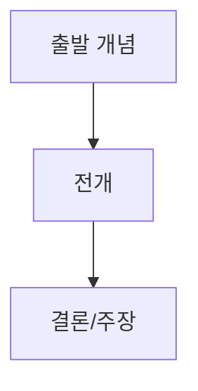

# 교육학 텍스트 구조화 요약 스킬

## 이 스킬이 하는 일

초등학교 교사가 교육학 텍스트를 읽고 자신의 말로 요약한 내용을 전달하면,
**항상 동일한 구조화 틀**로 정리하여 Markdown 파일을 생성한다.

핵심 가치: "늘 같은 틀"로 정리함으로써 여러 장/여러 책의 요약이 쌓였을 때
일관성 있게 비교·검색·회고할 수 있게 한다.

---

## 워크플로우

1. **사용자 입력 수신**: 사용자가 읽은 내용을 자신의 말로 요약하여 텍스트로 전달
2. **메타정보 확인**: 책 제목, 저자, 장 번호/제목이 언급되었는지 확인. 빠져 있으면 질문
3. **구조화 요약 작성**: 아래 템플릿에 따라 Markdown 작성
4. **파일 생성**: `/mnt/user-data/outputs/`에 Markdown 파일로 저장
5. **파일 공유**: present_files 도구로 사용자에게 전달

---

## 파일명 규칙

```
[책제목약칭]_ch[장번호]_요약.md
```

예시: `개념기반탐구학습_ch03_요약.md`

- 책 제목은 공백 없이 한글 약칭 사용
- 장 번호는 두 자리 (01, 02, ...)
- 장 번호가 없는 자료는 날짜 사용: `[자료명]_20260218_요약.md`

---

## 요약 템플릿

아래 템플릿을 **반드시 그대로** 사용한다. 섹션 순서와 구조를 바꾸지 않는다.

````markdown
# 📖 [책 제목] — [장 번호]. [장 제목]

> **저자**: [저자명]
> **요약 날짜**: [YYYY-MM-DD]
> **요약자**: 나

---

## 1. 한눈에 보기

이 장의 핵심 내용을 3~5문장으로 요약한다.
사용자가 전달한 내용의 큰 그림을 잡아주는 역할.

---

## 2. 핵심 개념 · 용어 정리

| 개념/용어 | 정의 · 설명 | 왜 중요한가 |
|-----------|-------------|-------------|
| ... | ... | ... |

사용자가 언급한 개념을 표로 정리한다.
사용자가 정의를 명확히 쓰지 않았더라도, 맥락에서 파악하여 보충 설명을 덧붙인다.
단, 사용자가 쓴 내용과 Claude가 보충한 내용은 구분한다.
Claude 보충분은 *이탤릭*으로 표시한다.

---

## 3. 핵심 논지 구조

이 장에서 저자가 전개하는 주요 주장의 흐름을 시각적으로 정리한다.
Mermaid 다이어그램 또는 화살표(→) 흐름도를 사용한다.



다이어그램 아래에 흐름을 1~2문장으로 보충 설명한다.

---

## 4. 수업 적용 아이디어

### 💡 나의 아이디어
사용자가 직접 언급한 수업 적용 아이디어를 정리한다.
사용자가 아이디어를 언급하지 않았다면 이 하위 섹션은 비워두고
"(아직 작성하지 않음 — 나중에 추가하세요)" 라고 표시한다.

### 🤖 Claude 제안
사용자의 요약 내용과 해당 장의 맥락을 바탕으로,
**초등학교 수업**에 실제로 적용할 수 있는 아이디어 2~3개를 제안한다.

각 제안은 다음 형식을 따른다:
- **아이디어 이름**: 한 줄 제목
- **적용 장면**: 어떤 교과/단원/상황에서 쓸 수 있는지
- **간단한 방법**: 2~3문장으로 구체적 실행 방법

제안할 때는 초등학교 현장의 현실성을 고려한다 (시간, 준비물, 학생 수준 등).

---

## 5. 나의 생각 · 메모

사용자가 전달한 텍스트에서 개인적 감상, 의문, 메모에 해당하는 내용을 여기에 옮긴다.
사용자가 이런 내용을 포함하지 않았다면 아래처럼 빈 공간을 남긴다:

> ✏️ _여기에 나중에 생각을 적어보세요._
>
> - 이 장을 읽고 가장 인상 깊었던 점은?
> - 기존에 알고 있던 것과 달랐던 점은?
> - 더 알고 싶은 것은?

---

## 6. 연결 고리

이전 장과의 연결, 또는 사용자가 이전에 요약한 다른 장/자료와의
관계를 짧게 메모하는 공간이다.

사용자가 언급한 연결점이 있으면 정리하고,
없으면 "(이전 장 요약과 비교하며 채워보세요)" 라고 표시한다.
````

---

## 작성 원칙

### 사용자의 말 존중
사용자가 전달한 내용이 요약의 **1차 재료**다.
Claude는 구조화·보충·제안의 역할이지, 원래 텍스트를 대신 읽어주는 역할이 아니다.
사용자가 쓴 표현을 최대한 살려서 정리한다.

### 보충과 원문의 구분
Claude가 맥락상 보충하는 설명은 반드시 *이탤릭*으로 구분한다.
이렇게 하면 사용자가 나중에 "이건 내가 쓴 거, 이건 Claude가 보충한 거"를
명확히 알 수 있다.

### 빈 공간의 가치
사용자가 채우지 않은 섹션은 억지로 채우지 않는다.
프롬프트(안내 질문)만 남겨서 사용자가 나중에 돌아와 채울 수 있게 한다.
이는 단순 요약이 아니라 **성찰적 독서 도구**로서의 역할이다.

### 시각적 구조화
표와 다이어그램을 적극 활용한다.
긴 문장 나열보다 표 한 장이 나중에 훑어보기 훨씬 좋다.

### 일관성 유지
여러 장에 걸쳐 반복 사용되므로, 템플릿 구조를 절대 바꾸지 않는다.
사용자가 명시적으로 틀 변경을 요청할 때만 수정한다.

---

## 메타정보가 부족할 때

사용자가 책 제목, 저자, 장 번호를 빠뜨린 경우:
- 첫 요약 시에는 물어본다
- 이미 이전 대화에서 확인한 적 있다면 그 정보를 재활용한다
- 정보를 끝내 모른다면 `[미상]`으로 표기하고 진행한다

---

## 사용 예시

**사용자 입력 예시:**
```
개념기반 탐구학습의 실천 3장 읽었어.
이 장은 "일반화"가 핵심이야. 일반화란 사실적 지식을 넘어서
개념 간의 관계를 진술한 것인데, 전이 가능한 이해를 만들어준대.
예를 들면 "문화는 환경에 의해 형성된다"가 일반화야.
수업에서 학생들이 일반화를 스스로 만들어보게 하면 좋겠다는 생각이 들었어.
```

이 입력을 받으면 위 템플릿에 맞춰:
- "한눈에 보기"에 3장의 핵심을 3~5문장 요약
- "핵심 개념"에 '일반화', '사실적 지식', '전이 가능한 이해' 등을 표로 정리
- "핵심 논지 구조"에 사실→개념→일반화→전이의 흐름을 다이어그램으로
- "수업 적용 아이디어"에 사용자의 아이디어를 정리하고 + Claude 제안 추가
- "나의 생각·메모"에 사용자의 감상을 옮기거나 빈 공간 유지
- Markdown 파일로 저장하여 전달
